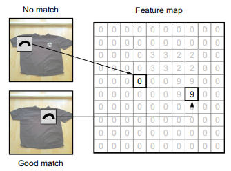
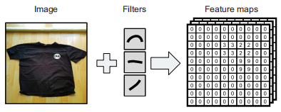
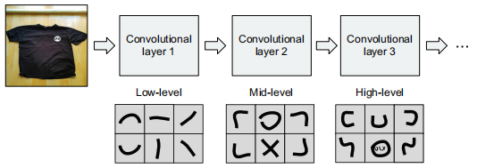
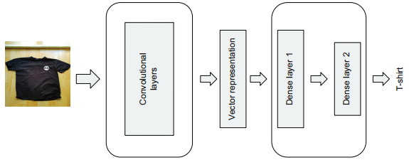
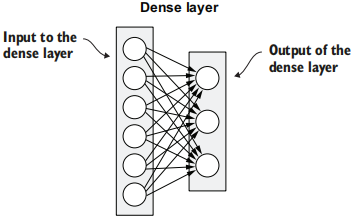

# 一、机器学习简介

监督式机器学习：为模型提供特征和目标变量，然后模型会计算出如何使用这些特征达成目标。
### 分类
1. 回归：数值，例如价格或者温度
2. 分类：二元分类-多元分类
3. 排名：一组元素的排序
### 步骤
#### 1. 问题理解
确定问题，理解问题，选择解决方案
#### 2. 数据理解
分析可用数据集并决定是否收集数据。问题：1. 数据集太小；2.过于嘈杂
#### 3. 数据准备
把数据转换为可用作模型输入的表格形式
#### 4. 建模

#### 5. 评估
 训练数据集-验证数据集-模型数据集
#### 6. 部署

# 二、用于回归的机器学习
——解决回归问题的线性回归-汽车价格预测

## （一） 探索性数据分析
——Exploratory Data Analysis, EDA
· 目标变量的分布
· 此数据集的特征
· 这些特征值的分布
· 数据质量
· 缺失值的数量
#### 1 数据处理-所有列名小写并用下划线代替空格
```
df.columns = df.columns.str.lower().str.replace(' ', '_')
```
`.str.lower()` 和 `.str.replace(' ', '_')` 可以组合使用，这是因为 Pandas 提供了一个强大的字符串操作接口，允许我们在一个链式调用中连续应用多个字符串方法。
##### #`.replace()`
`Series.str.replace(pat, repl, n=-1, case=True, regex=True)`
- **pat**: 要替换的子字符串或正则表达式。
- **repl**: 用于替换的字符串。
- **n**: 最多替换的次数，默认为 -1 表示替换所有匹配项。
- **case**: 是否区分大小写，默认为 True。
- **regex**: 是否将 `pat` 作为正则表达式处理，默认为 True。
#### 2 数据处理-选择带有字符串值的列
```
string_columns = list(df.dtypes[df.dtypes == 'object'].index)
```
1. **`df.dtypes`**: 获取DataFrame中每个列的类型。
    ```python
    import pandas as pd
    # 创建一个示例DataFrame
    data = {
        'name': ['John', 'Jane'],
        'age': [28, 34],
        'city': ['New York', 'Los Angeles']
    }
    df = pd.DataFrame(data)
    print(df.dtypes)
    ```
    输出：
    ```
    name    object
    age      int64
    city    object
    dtype: object
    ```
    `df.dtypes` 返回一个Series，其中索引是列名，值是列的数据类型。
2. **`df.dtypes == 'object'`**: 创建一个布尔Series，用于标识哪些列的数据类型为 `object`。
    ```python
    is_object = df.dtypes == 'object'
    print(is_object)
    ```
    输出：
    ```
    name     True
    age     False
    city     True
    dtype: bool
    ```
    这个布尔Series表明哪些列的数据类型是 `object`（即字符串类型）。
3. **`df.dtypes[df.dtypes == 'object']`**: 通过布尔索引过滤出数据类型为 `object` 的列。
    ```python
    object_columns = df.dtypes[df.dtypes == 'object']
    print(object_columns)
    ```
    输出：
    ```
    name    object
    city    object
    dtype: object
    ```
    这个Series只包含数据类型为 `object` 的列。
4. **`.index`**: 获取过滤后的Series的索引，即列名。
    ```python
    object_column_names = object_columns.index
    print(object_column_names)
    ```
    输出：
    ```
    Index(['name', 'city'], dtype='object')
    ```
    这一步返回所有字符串列的列名。
5. **`list(...)`**: 将索引对象转换为列表。
    ```python
    string_columns = list(object_column_names)
    print(string_columns)
    ```
    输出：
    ```
    ['name', 'city']
    ```
    最终，`string_columns` 是一个包含所有字符串列名的列表。
#### 3 目标变量分析
##### #.histplot()
`sns.histplot()` 是 Seaborn 库中的一个函数，用于绘制直方图和内核密度估计图（KDE）。直方图用于显示数据分布的近似表示，是数据分析和可视化中非常常用的工具。有以下参数：
- **data**: 数据集，可以是数组、列表、Pandas Series 或 DataFrame。
- **x**: 指定用于绘图的变量，通常是 DataFrame 中的列名。
- **bins**: 指定直方图中的柱子（bin）的数量或边界。
- **kde**: 是否绘制内核密度估计图，布尔值（`True` 或 `False`）。
- **stat**: 指定直方图的统计量类型，可以是 `'count'`、`'frequency'`、`'density'` 或 `'probability'`。
- **element**: 指定直方图元素类型，可以是 `'bars'`、`'step'` 或 `'poly'`。
- **multiple**: 指定直方图的堆叠方式，可以是 `'layer'`、`'dodge'`、`'stack'` 或 `'fill'`。
- **palette**: 指定颜色调色板，用于多类别数据。
- **hue**: 指定分组变量，用于绘制多个直方图。
##### #.长尾分布
长尾的分布会让我们很难看到分布，但是它对模型的影响会很大，会混淆模型，从而阻碍模型学习的足够好。解决方案是对数变换。
长尾分布：多数集中+长尾现象
对数变换：缩小范围+减小方差（接近正态）+减少极端值的影响+线性化非线性关系「？？为啥」
#### 4 检查缺失值
#### 5 验证框架
## （二）回归
#### 1 线性回归
矩阵什么的数学知识，理解的不大深入
看书后面的附录
#### 2 训练模型
呃，用了**标准方程（即，正规方程）**。 $w=(X^TX)^{-1}X^Ty$
## （三）预测价格
#### 1 缺失值处理
删掉相关行。用0代替——等同于忽略，不会影响结果。用平均值代替
#### 2 RMSE评估模型
——Root Mean Squared Error，均方根误差
$REMS=\sqrt{\frac{1}{m} \sum_{i=1}^{m} (g(x_i)-y_i)^2}$
#### 3 验证模型
不过是用验证集跑一次而已
#### 4 分类变量
ONE-HOT编码（书翻译成“独热编码”也太搞了）
#### 5 正则化
控制模型的权重，使其行为正确，不出现增长过大的情况
正则线性回归通常称为岭回归
一种方法是给矩阵的每个对角元素加一个小的数值，$w=(X^TX+\alpha I)^{-1}X^Ty$
哭哭哭哭这一领域没搞明白

# 三、用于分类的机器学习
——用于解决分类问题的逻辑回归-客户流失预测

1. 下载数据集，并且进行数据处理，保持一致性
2. 把数据分为训练、验证、测试三部分
3. 确定重要特征
4. 将分类变量转化为数值变量
5. 训练逻辑回归模型
### （一）探索性数据分析
#### 1 pandas类型判错错误
"TotalCharges"是object类型，需要转化为float64类型。造成这样结果的原因很可能是：该列存在需要额外预处理的缺失值的特殊编码
#####  pd.to_numeric(arg,errors,downcast)
强制变为数值型，若遇非数值类型，则通过`errors='coerce'`跳过这些情况，这样Pandas将用`NaN`替换所有非数字类型：`total_charges = pd.to_numeric(df.TotalCharges, errors='coerce')`
- **arg**: 要转换的数据，可以是单个值、列表、Series 或 DataFrame。
- **errors**: 用于处理错误的策略，有三个选项：
  - `'raise'`（默认）：如果有无法转换的值，则引发错误。
  - `'coerce'`：将无法转换的值设置为 NaN（缺失值）。
  - `'ignore'`：保留无法转换的值，不做任何更改。
- **downcast**: 选择将数据类型向下转换的方式，通常用于节省内存。选项包括 `'integer'`、`'signed'`、`'unsigned'`、`'float'`。

确认包含非数值字符：`df[total_charges.isnull()][['customerID', 'TotalCharges']] #左边先来一个布尔索引筛出空值，再通过[]取列——>确实存在缺失值`
#### 2 拆分训练集和验证集
`train_test_split()` 是 scikit-learn 库中的一个函数，用于将数据集分割为训练集和测试集。这个函数是机器学习项目中非常常用的工具，因为它帮助你将数据集分成两个部分：一个用于训练模型，另一个用于测试模型的性能。这样可以确保模型的评估是基于未见过的数据，从而获得更可靠的性能指标。
```python
from sklearn.model_selection import train_test_split
# 假设 X 是特征数据，y 是目标变量
X_train, X_test, y_train, y_test = train_test_split(X, y, test_size=0.2, random_state=42)
```
- **X**: 特征数据（通常是一个二维数组或 DataFrame）。
- **y**: 目标变量（通常是一维数组或 Series）。
- **test_size**: 测试集的比例或数量。可以是一个浮点数（表示比例）或一个整数（表示具体的测试样本数量）。例如，`test_size=0.2` 表示将 20% 的数据用作测试集，`test_size=100` 表示测试集包含 100 个样本。
- **train_size**: 训练集的比例或数量。可以省略，`train_size` 会根据 `test_size` 自动计算。
- **random_state**: 随机种子，用于保证结果的可重复性。设置相同的种子会得到相同的训练集和测试集分割。如果不设置或设置为 `None`，每次运行时数据分割可能会不同。
- **shuffle**: 是否在分割前打乱数据。默认为 `True`，表示会打乱数据。设置为 `False` 时，则不会打乱数据，分割将按原始顺序进行。
- **stratify**: 用于指定分层抽样的变量。可以是目标变量 `y`，这样可以确保训练集和测试集中目标变量的比例与整体数据集一致。通常用于分类问题，以确保各类别的分布一致。
#### 3 分类变量有多少个唯一值
`df_train_full[categorical].nunique()`
#### 4 特征重要性分析
1. 流失率：比较分组流失率和总体流失率
2. 风险率：风险 = 分组率/总体率。接近于1则越无影响。
3. 互信息：衡量**分类变量**与目标变量之间的依赖程度——相关OR独立。==信息论==
4. 相关系数：就高中学的，也称皮尔逊相关系数
##### 风险率-分组操作

 `.groupby()`
```python
DataFrame.groupby(by=None, axis=0, level=None, as_index=True, sort=True, group_keys=True, dropna=True)
```
- **by**: 用于分组的列或列名，可以是一个字符串或一个列表。
- **axis**: 按行或按列分组，默认是按行（`axis=0`）。
- **level**: 如果有层级索引，可以指定分组的级别。
- **as_index**: 是否将分组列设置为结果的索引，默认是 `True`。
- **sort**: 是否对分组结果进行排序，默认是 `True`。
- **group_keys**: 是否将分组键添加到结果的索引中，默认是 `True`。
- **dropna**: 是否丢弃包含 NaN 值的组，默认是 `True`。
 `.agg()`
```python
DataFrame.agg(func=None, axis=0, *args, **kwargs)
```
- **func**: 聚合函数或函数列表。例如，可以是 `'mean'`、`'sum'` 或一个自定义函数。
- **axis**: 指定对行或列应用聚合函数，默认是对列（`axis=0`）。
- **args**: 传递给函数的其他位置参数。
- **kwargs**: 传递给函数的其他关键字参数。
##### 互信息
```python
from sklearn.metrics import mutual_info_score
def calculate_mi(series): # 计算互信息的独立函数
    return mutual_info_score(series, df_train_full.churn)
df_mi = df_train_full[categorical].apply(calculate_mi) # 计算“分类列”的互信息
df_mi = df_mi.sort_values(ascending=False).to_frame(name='MI') #对结果进行排序
df_mi
```
`apply()`: `pandas DataFrame` 的一个方法，用于将指定的函数应用到 DataFrame 的每一列或每一行。`apply()` 可以用来处理数据，计算统计量，或进行其他转换。
`.sort_values(ascending=False)`：对series进行降序排序
`.to_frame(name='MI') `：转化为DataFrame并取列名为MI
### （二）特征工程
——直接套函数啦
##### # DataFrame.to_dict(orient='records', into=<class 'dict'>)
- **`orient`**: 指定转换字典的格式。`'records'` 是其中一种选项，表示每一行将被转换为一个字典，每个字典的键是列名，对应的值是该行的值。
- **`into`**: 这是一个可选参数，指定返回的字典的类型，默认为 `dict`。
##### # DictVectorizer
```python
from sklearn.feature_extraction import DictVectorizer
dv = Dicvectorizer(sparse=False)
dv.fit(train_dict)
X_train = dv.transform(train_dict)
```
创建**Dicvectorizer实例**，调用**fit方法**训练，创建==非稀疏==矩阵，用**transform方法**将字典转化为矩阵
### （三）分类
老朋友`sigmoid()`函数啦
```python
from sklearn.linear_model import LogisticRegression
model = LogisticRegression(solver='liblinear', random_state = 1)
model.fit(X_train, y_train)

val_dict = df_val[categorical + numerical].to_dict(orient='records')
X_val = dv.transform(val_dict)
y_pred = model.predict_proba(X_val)[:,1]
```
# 六、决策树与集成学习
——二元分类问题
## （一）信用风险评估项目
### 1. 数据清理
统一列名-小写化
表示出分类变量的实际含义
除去极端个例、数据确实
### 2. 准备数据集
将数据集划分为训练集、验证集、测试集
处理缺失值
使用one-HOT编码
创建特征矩阵X和目标变量y
## （二）决策树
对一系列if-then-else规则进行编码的数据结构。
```python
from sklearn.tree import DecisionTreeClassifier
dt = DecisionTreeClassifier()
dt.fit(X_train, y_train)

# 可视化
from sklearn.tree import export_text
tree_text = export_text(dt, feature_names=dv.feature_names_) #one-hot时产生的
print(tree_text)
```
### 1 AUC评估
描述一个随机选择的正例（default）比一个随机选择的负例（OK）得分更高的概率
### 2 决策树算法
#### 杂质度
纯与不纯。标准：误分类率、熵、基尼杂质度
#### 划分特征选取
对于每个特征尝试所有阈值->对于每个阈值测量杂质度->选择具有最低杂质度的特征和阈值
#### 停止标准
组的纯度足够高；树达到深度限制-max_depth；分组太小无法继续划分-min_samples-leaf
### 3 决策树的参数调优
暴力枚举啦
## （三）随机森林
多个模型的输出合并成一个，得到错误答案的机会会更小——集成学习
模型的组合——继承

得到不同模型的简单方法：不同的特征子集上训练

随机森林训练：训练N个单独的决策树模型->对于每个模型，选择一个随机的特征子集并只使用它们进行训练->进行预测时，将N个模型的输出合并成为一个
```python
from sklearn.ensemble import RandomForestClassifier
rf = RandomForestClassifier(n_estimators=10,random_state=3)
rf.fit(X_train, y_train)
y_pred = rf.predict_proba(X_val)[:,1]
roc_auc_score(y_val, y_pred)
```
### 参数调优
```python
aucs = []
for i in range(10, 201, 10):
    rf = RandomForestClassifier(n_estimators=i,random_state=3)
    rf.fit(X_train, y_train)

    y_pred = rf.predict_proba(X_val)[:,1]
    AUC = roc_auc_score(y_val, y_pred)
    print('%s -> %.3f' % (i, AUC))

    aucs.append(AUC)
plt.plot(range(10,201,10), aucs)
```
```python
# depth
all_aucs = {}  # 这里创建一个字典

for depth in [5, 10, 20]:  # 遍历不同的深度
    print('depth: %s' % depth)
    # 对当前的深度进行探索
    aucs = []
    for i in range(10, 201, 10):  # 尝试不同的树的数量的集成树
        rf = RandomForestClassifier(n_estimators = i, max_depth = depth, random_state = 1)  # 对应的参数
        rf.fit(X_train, y_train)  # 开始进行训练
        y_pred = rf.predict_proba(X_val)[:, 1]
        auc = roc_auc_score(y_val, y_pred)
        print('%s -> %.3f' % (i, auc))
        aucs.append(auc)
    all_aucs[depth] = aucs
    print()
num_trees = list(range(10, 201, 10))
plt.plot(num_trees, all_aucs[5], label = 'depth = 5')
plt.plot(num_trees, all_aucs[10], label = 'depth = 10')
plt.plot(num_trees, all_aucs[20], label = 'depth = 20')
plt.legend()

# min_samples_leaf
all_aucs = {}
 
for m in [3, 5, 10]:
    print('min_samples_leaf: %s' % m)
    aucs = []
 
    for i in range(10, 201, 20):
        rf = RandomForestClassifier(n_estimators=i, max_depth=10, min_samples_leaf=m, random_state=1)
        rf.fit(X_train, y_train)
        y_pred = rf.predict_proba(X_val)[:, 1]
        auc = roc_auc_score(y_val, y_pred)
        print('%s -> %.3f' % (i, auc))
        aucs.append(auc)
   
    all_aucs[m] = aucs
    print()
num_trees = list(range(10, 201, 20))
plt.plot(num_trees, all_aucs[3], label='min_samples_leaf=3')
plt.plot(num_trees, all_aucs[5], label='min_samples_leaf=5')
plt.plot(num_trees, all_aucs[10], label='min_samples_leaf=10')
plt.legend()
```
## （四）梯度提升
训练当前模型->查看它导致的错误->训练令一个模型来纠正这些错误->再次查看错误并按顺序重复此过程
### 1 XGBoost：极限梯度提升
——Extreme Gradient Boosting
```python
import xgboost as xgb

dtrain = xgb.DMatrix(X_train, label=y_train, feature_names=dv.feature_names_) #把数据封装到DMatrix-高效查找划分点的特殊数据结构
dval = xgb.DMatrix(X_val, label=y_val, feature_names=dv.feature_names_)
xgb_params = {
    'eta': 0.3,
    'max_depth': 6,
    'min_child_weight': 1,

    'objectove': 'binary:logistic',
    'nthread': 8,
    'seed': 1,
    'silent': 1
}
model = xgb.train(xgb_params, dtrain, num_boost_round=10)
y_pred = model.predict(dval)
roc_auc_score(y_val, y_pred)
```
### 2 模型性能监控
```python
watchlist = [(dtrain, 'train'), (dval, 'val')]

xgb_params = {
    'eta': 0.3, # 学习率
    'max_depth': 6,
    'min_child_weight': 1,

    'objectove': 'binary:logistic',
    'eval_metric': 'auc', # 解决的任务类型
    'nthread': 8, # 训练模型的线程数
    'seed': 1, # 随机数发生器种子
    'silent': 1 # 是否开启静默模式，1：只输出警告
}
model = xgb.train(xgb_params, dtrain, num_boost_round=100, evals=watchlist, verbose_eval=10)
```
### 3 参数调优
——枚枚举，找到最终的最优解就行
**学习率**：
梯度提升过程中，每棵树都尝试修成前一棵树的错误，ETA决定了修正的权重
### （五）后续
极限随机化树-额外树
所有基于树的模型都可以解决回归问题
# 七、神经网络与深度学习

——用于回归和分类的神经网络+图像
## （一）服装分类
```python
import tensorflow as tf
from tensorflow import keras

from keras.preprocessing.image import load_img
path = './clothing-dataset-small/train/t-shirt'
name = 'fb3f29fb-ae30-41a5-84cd-c1e3ccad0307.jpg'
fullname = path + '/' + name
load_img(fullname, target_size=(299,299))
```
## （二）卷积神经网络
—— Xception
### 1 使用预训练模型
```python
from keras.applications.xception import Xception # 实际模型
from keras.applications.xception import preprocess_input # 准备模型要使用的图像的函数
from keras.applications.xception import decode_predictions # 解码模型的预测的函数
model = Xception(
    weights = 'imagenet', # 使用来自ImaageNet的预训练模型
    input_shape = (299, 299, 3), # 高度、宽度、通道数
)
img = load_img(fullname, target_size=(299,299))
x = np.array(img) # Image对象->转换为Numpy数组
X = np.array([x]) # ⭐
X = preprocess_input(X) # 在模型应用到图像之前，要用preprocess_input准备
```
⭐：要得到一批图像，这个数组需要四个维度：图像数、宽度、高度、通道数。
### 2 获得预测
```python
pred = model.predict(X)
pred.shape
# Xception模型预测图像是否属于1000个类中的一个，因此预测数组中的每个元素都是属于这些类中的一个的概率
decode_predictions(pred)
```
## （三）模型的内部结构
Xception模型包含71层，其中最重要的层如下展开
### 1 卷积层
一组过滤器，把过滤器的内容与过滤器下面的图像进行比较，记录相似程度，得到特征图，数字越大越匹配。实际上，多个滤波器得到多个特征图。
把一个卷积层的输出作为下一层的输入。下一层的过滤器把前一层的形状组合成更复杂的结构。
最后得到图像的向量表示：一个一维数组，每个位置对应高级的视觉特征。（致密层运用这些高级特征得出最终决策）







### 2 致密层

多个逻辑回归模型放在一起，组成一个输出层。
一个只有一层的网络：这一层把输入转换为输出——致密层：把输出如的每个元素与输出的所有元素连接起来，即“全连接”





## （四）训练模型
训练卷积神经网络需要大量时间和数据，捷径——**迁移学习**，使用预训练模型适用于问题的方法。
### 1 迁移学习
训练的困难通常来自于卷积层。为了更好的提取优秀的向量表示，过滤器需要学习良好的向量表示，这样训练卷积层会相对容易。
因此可以，保留ImageNet上预训练神经网络的卷积层，舍弃其致密层而训练新层。
### 2 加载数据
本来：将这个数据集加载到内存并用它获取X——特征矩阵。但是，我们可能没有足够的内存来保存所有图像，别的解决方案如下。
小批量地从磁盘加载图像。
```python
from tensorflow.keras.preprocessing.image import ImageDataGenerator

image_size = (150, 150)
batch_size = 32
# 验证集同理
train_gen = ImageDataGenerator(
    preprocessing_function=preprocess_input # 对每个图像使用preprocess_input函数
)
train_ds = train_gen.flow_from_directory(
    'clothing-dataset-small/train', # 从训练集目录加载所有图像
    target_size=image_size, # 使用上文设置的image_size
    batch_size=batch_size, # 使用上文设置的batch_size
)
```
### 3 创建模型
```python
base_model = Xception( # 迁移学习
    weights='imagenet', # 加载预训练模型
    include_top=False, # 去掉最后的全连接层，只保留卷积层——top指的是网络的最后一层（见图）
    input_shape = (150,150,3)
)
base_model.trainable = False # 冻结基本模型

# 构建服装分类模型
inputs = keras.Input(shape=(150,150,3)) # 指定期望的数组输入和大小：输入图像为150*150+3通道
base = base_model(inputs, training=False) # 创建基本模型：使用base_model提取高级特征
vector = keras.layers.GlobalAveragePooling2D()(base) # 池化层：把base_model的输出作为输入，提取向量表示——全局平均池化层
outputs = keras.layers.Dense(10)(vector) # 致密层：添加一个大小为10的致密层，每个元素代表一类
model = keras.Model(inputs, outputs)
```
### 4 训练模型
```python
learning_rate = 0.01
optimizer = keras.optimizers.Adam(learning_rate) # 优化器
loss = keras.losses.CategoricalCrossentropy(from_logits=True) # 交叉熵损失函数

# 或者：outputsa = keras.layers.Dense(10, activation='softmax')(vector) loss=keras.losses.CategoricalCrossentropy()

model.compile(
    optimizer = optimizer,
    loss = loss,
    metrics=['accuracy']
)

model.fit(train_ds, epochs=10, validation_data=val_ds) # 对整个训练数据集的一次迭代成为一个迭代器(epcho)
```
### 5 调整学习率
### 6 保存模型和设置检查点
```python
# model.save_weights('xcsption_v1_model.h5', save_format = 'h5')

checkpoint = keras.callbacks.ModelCheckpoint(
    "xception_v1_{epoch:02d}_{val_accuracy:.3f}.keras", # 指定保存模型的文件名模板
    save_best_only = True, # 只有当模型优于之前迭代时才保存模型
    monitor = 'val_accuracy', # 监控指标
)
model = make_model(learning_rate=0.001)
model.fit(
    train_ds,
    epochs=10,
    validation_data=val_ds,
    callbacks=[checkpoint]
)
```
### 7 添加更多的层
```python
inputs = keras.Input(shape=(150,150,3))
base = base_model(inputs, training=False)
vector = keras.layers.GlobalAveragePooling2D()(base)

inner = keras.layers.Dense(100, activation='relu')(vector)
# 来个常见的激活函数啦Rectified Linear Unit
outputs = keras.layers.Dense(10)(inner)
model = keras.Model(inputs, outputs)
```
### 8 正则化和dropout
添加新层后，过拟合的可能性显著增加，为了避免这种情况，需要在模型中添加正则化。
dropout：训练时冻结致密层的一部分，每次迭代期中，冻结的部分是随机选择，从而解决过拟合
`drop = keras.layers.Dropout(0.2)(inner) # inner是连接的上一层`
### 9 数据增强
从现有图像中生成更多模型：翻转图像、旋转图像、缩放图像、错切图像、移动图像……（数据增强也是种正则化策略）
```python
train_gen = ImageDataGenerator(
	rotation_range=30, # 随机旋转-30°-30°
	width_shift_range=30.0, # 水平移动
	height_shift_range=30.0, # 垂直移动
	sheaeer_range=10.0, # 错切变换
	zoom_range=0.2, # 缩放
	horizontal_flip=True, # 水平翻转
	vertical_flip=False, # 不垂直翻转
    preprocessing_function=preprocess_input # 对每个图像使用preprocess_input函数
)
```
### 10 训练更大的模型
改大图像大小就ok
## （五）训练模型
`model.evaluate(tst_ds)` 略……

# 总结

## 线性回归-汽车价格预测
1. 读取
2. 数据处理：
所有列名小写并用下划线代替空格
所有字符串列的值用下划线替换空格并且小写化（只选择带有字符串值的列）
3. 目标变量分析：
可视化显示数据分布
出现长尾分布，采用LOG
4. 缺失值检查：
用0填充
5. 数据准备：
分类变量- ONE HOT编码
拆分-训练集、验证集、检查集
准备好X_…，Y_……（选取特征）
6. 线性回归：
数学公式代入
正则化-控制权重
7. 预测
8. 检查：RMSE评估模型
## 分类-逻辑回归-客户流失预测
1. 读取
2. 数据处理：
「缺失值」查看变量类型-发现数字是文本-猜测导致原因是有空白
「缺失值」文本列转化为数字类型，并检查缺失值以验证猜想
「缺失值」用0填充缺失值
所有列名小写并用下划线代替空格
「没必要随便」目标变量数字化（“yes”->1，而非"1"->1）
拆分-训练集、验证集、检查集
3. 初步数据分析：
检查缺失值
计算流失率
分别存储分类特征与数值特征的列名
查看分类变量有多少唯一值
4. 特征重要性分析：
流失率-数值差越大越好
风险率-求比值
相关系数
5. 特征工程
用DictVectorizer统一调用One-Hot
6. 模型：
直接用LogisticRegression
7. 预测
8. 检查
## 分类-决策树/集成学习-信用风险评估
1. 数据处理
用字符意义替换数值表示（为了直观理解？）
缺失值替换1（原数据中表示为99999999）
删除未知结果的数据
拆分-训练集、验证集、检查集
缺失值替换2（原数据中表示为NaN）
使用One-HOT
#### 法一：决策树
2. 模型
DecisionTreeClassifier
3. 评估
AUC
#### 法二：随机森林
2. 模型
RandomForestClassifier
3. 评估
AUC
#### 法三：XGBoost梯度提升
数据封装
XGBoost预设
PS：性能监控预设
## 图分类-神经网络/迁移学习-服装
1. 数据加载
（已提前处理好训练集和验证集）
用preprocess_input预处理
设定加载模式-图像大小、每次加载数量
2. 创建模型
（迁移学习）基础模型-预训练、去掉顶层、输入数据尺寸
冻结基础模型-无须后续再训
构建模型-输入、基模、池化层、（隐藏层、）致密层（输出）
3. 训练模型
参数：学习率、优化器、损失函数
模型加载-compile
模型训练-fit
4. 其它操作
保存模型-设置检查点
dropout正则化