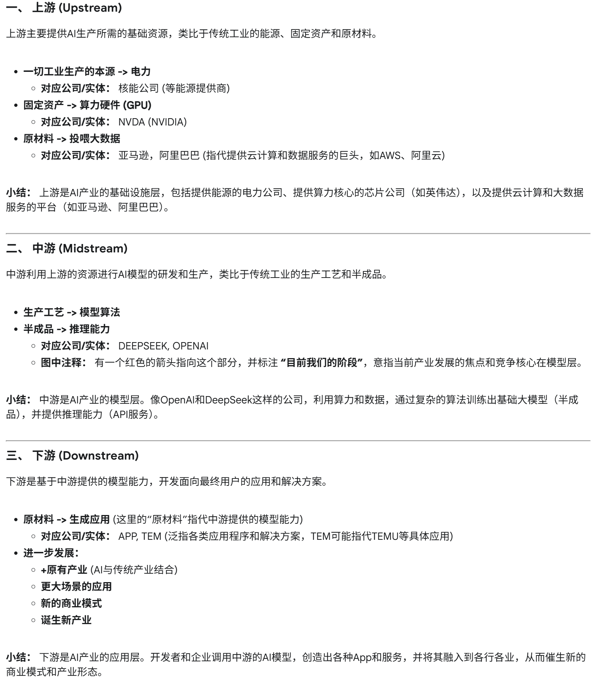

最近调了两辆车，红温ing：

- 科技创新实践的课程：软件没问题，硬件上不知道为什么调不对。后续发现只要按下复位键，代码就能正常运行了。

- 极速越野的智能小车比赛：编码器一直没调通。已经准备快一个月了，编码器就前天晚上是正常的。原因总是诸如：引脚接错、电路引脚配置错误、编码器接线不稳定…… 软件无能为力。

  晚上要等硬件好了才能调软件…… 早点回去得了，明早再来调车吧，不是很想熬夜…

### 【“万事俱备，只欠硬件”】

继续往下讲，AI的发展主因不也归咎于硬件（E.X. 英伟达的显卡）么，算法层面并没有突破性的进展，算力才是关键性变量。（像Transformer17年就提出了对吧）
玩硬件的时候，总是遇到“不知道为什么”的情景，各种无法用逻辑解释的“bug”。真实的物理环境下，电压的微小波动、元器件的细微差异、甚至空气中的静电，都可能让它“状态异常”。

相比之下，长时间以来一直喜欢玩软件，可能因为其脱离了这种物理的束缚，代表着抽象、逻辑和无限的可能性的新世界——一种意志的延伸。只要你的逻辑是自洽的，思想就能延伸为创造：构建一个虚拟城市、谱写一段旋律、设计一套系统架构。背后的确定性，这种确定性，这种通过智力活动便能创造和掌控一个世界的纯粹快感，是极度令人着迷的

但可惜的是，它具有依赖性。“我的世界”的流畅运行不就依赖于一台性能正常的手机嘛。软件工程师们可以创建无数个元宇宙，但再宏大的地球online也无法用一个if-else判断杜邦线是否接触不良。“经济基础决定上层建筑”。

Then，职业选择与人格。软件的问题，原则上都可以通过逻辑和追溯（debug）来解决；对于硬件，面对的不仅是逻辑，更是物理定律的“随机性”。那么，对于追求秩序、逻辑自洽和抽象思维的人，也就是NT【Ni+Te或Ti+Ne】，更适合走软件（？

### 【选择“卖铲子”还是“挖金子”】

顺便再丢个AI的产业链：

蹭活动听到的，Rokid老总（貌似）说过类似的：我“信念”硬件，即使软件不断变化，归根到底还是离不开硬件，所以我选择了硬件。

### 【软件的变化】
（写不动了，略，就到这里，以后再细聊有）

