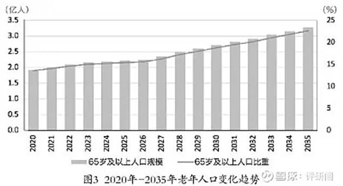

> 注意：文中所有“我”不代表作者观点，文章系从各大媒体转载并经整合提炼而成

## 我们为什么要做养老投资？

人是有生命年龄期限的物体，从年轻到年老是每个人必经的阶段，这是无法逃脱的自然规律。年轻时候，人们可以通过体力劳动、工作、创业、投资等都获取一定的收益回报，但年老退休时选择的方向就少了。

每当看到那些年过花甲的老人在街边摆摊情景时，我就会在想：如果我老了，我会是怎样的，我想要的是什么样的生活，在我还年轻的时候，我要如何规划好我的投资，当有一天我老了退休的时候，可能会拥有什么样的保障。

我觉得养老投资的目标是给我们个人退休后提供一种保障，这个保障包含我们的生命和生活。

首先，退休之后，人之暮年，最需要抵御的风险就是疾病的风险，现在重大疾病的发病率越来越高，一旦一人生病，很大概率会拖累全家。这是真实而又难以解决的社会现实，所以养老金中一定要有保障医疗的部分。

其次，基本生活保障肯定是要有的，而且我们都不希望随着年龄的增长，生活质量反而下降了。尤其是我们这代人，在年轻时或多或少都体验过那些潇洒的都市生活，如果退休后要开始吃糠咽菜，我相信是很多人所不能忍受的。

规划养老金要实现 **两个目标**：

- 一是保障自己老了之后看得起病；
- 二是不降低自己的生活质量。

既然养老规划这么重要，那我们应该怎么做？

## 现状分析

### 顶层设计

从我国目前的养老保障体系顶层设计来看，已经形成以基本养老保险为第一支柱，企业年金为第二支柱，商业养老保险为第三支柱的三大养老保障体系。

但目前仍处于第一支柱独大（国家强制，人民踊跃），第二支柱短板（老板和人民都不感兴趣，覆盖率小），第三支柱薄弱（人民并不买账）的境地。

尤其对于 80-00 后普通人，这几代人退休后，一方面人口老龄化严重，分蛋糕的人多了，另一方面年轻人锐减，供养蛋糕的人少了，到时会面临巨大的养老金发放压力。

### 养老模式

从国家对养老问题的态度看，主要以家庭养老为主导，强化社会养老保险，引进商业养老保险、公募养老基金等，建立多种形式并存的养老保障体系。

目前我国养老现状与模式主要为社会养老，家庭养老，自我储蓄养老三种基本养老方式。

1. 社会养老：目前社会养老得益性较差，特别是农村，社会养老制度有待普及和完善。国家目前推行的社会保障现状是广覆盖，低保障，费用控制不力，运行效率不高，保障制度不公平等现象，造成结果保而不包或部分人基本无保障。

2. 家庭养老：这是目前最普遍的养老方式，也是民族传统美德之体现。在现有经济条件及传统文化模式下，家庭养老仍然是我国家庭的主流养老方式。

   有关资料显示：老年人口的全部经济来源构成中，来自子女供给部分在城市占 16.8%，在县城占 38.1%，在农村地区这个比例更高。这说明子女供养在城市老年人中占有一定地位，而在农村中则占有重要甚至是主要地位。

3. 自我储蓄养老：依靠平时的积蓄用来防老，在整个城乡仍然有一定的市场。据国务院经济发展中心对农村的调查，30% 的家庭对养儿防老已丧失信心，他们认为只有自己掌握钱财是最可靠的。因而尽可能省吃俭用，节约储蓄以备老年之用。但是，低利率、高膨胀、天文数字的医疗费以及未来高昂的生活费用，使得储蓄养老已力不从心。

### 风险与挑战

**第一支柱式微：**

据统计，第一支柱目前占主导地位，规模已超 6 万亿元，占比高达 70%，第二支柱的规模仅为 2 万亿元，第三支柱刚刚起步规模相对较小。

事实上，随着我国人口老龄化进程的加快，第一支柱已经很难满足人们追求高质量的养老生活需求，尤其是目前我国没有基本养老保险的人有近 5 亿，大部分属于年轻人。而年轻恰是养老准备阶段，**养老投资越早，财富增值、复利效果越好**。

养老金替代率是衡量劳动者退休前后生活保障水平差异的基本指标之一，指 _劳动者退休时的养老金领取水平与退休前工资收入水平之间的比率_。据世界银行提出，养老金只有达到退休前收入的 70-80%，老年人的生活福祉、质量才不会下降。

据数据显示，我国人均每月 **基本养老金的替代率不到 45%**，基本呈逐年下降趋势，那么对于个人投资养老需求是非常迫切的，也是目前国家政策鼓励个人养老金的发展。

因此，发展第三支柱是未来养老市场的大势所趋，也是普通人都能够更好的享受到额外养老金待遇，以及为提前做好个人养老规划准备。

**家庭养老受冲击：**

市场经济的逐步建立和社会经济现代化以及人口流动的过程中，传统的家庭养老开始面临诸多挑战。如，1995 年全国家庭规模为 3.9 人／户，2000 年第五次人口普查结果为 3.44 人／户，2005 年为 3.13 人／户。家庭结构也转变为以核心家庭为主体，父母与未婚子女组成的完全核心家庭占 57.81%。家庭户平均规模的缩小和完全核心家庭的增多导致纯老年户不断增加。

现代社会人口流动越来越快，年轻人迫于竞争压力，忙于工作和事业，使他们无暇顾及老父和老母；同时，一些青年夫妇较重视子女的教育和成长问题，有限的时间精力和财力都向子女倾斜，产生了 “重幼轻老” 现象，这对老年父母的心理健康和实际的生活质量都产生了负面影响。

老年人平均寿命延长、患病率、伤残率上升、自理能力下降。随着社会生活水平的不断提高，老年人的寿命也在不断延长。同时，随着年龄增长（特别是超过 75 岁之后），老年人口健康状况有所恶化，患病率、伤残率会上升，自理能力下降，这一切必将加大家庭的负担，也必将导致年轻人拒养老人的消极情绪增加。

40 年前中国老年人与儿童的比率是 1:6。数据预计 2050 年中国 60 岁以上老人将占到总人口的 31%，即老人和儿童的比率将变 2:1。一个 “银发中国已距我们越来越近，传统的养儿防老观念，已受到 “老年化” 的冲击。我们依靠家庭养老还能持续多久？

## 怎么做？

养老投资规划可以从以下 4 个步骤着手：

### 一、交养老金

#### 养老金可能有哪些？

按照新制度的设计，职工退休后的养老金分为两部分：

- 一是基础养老金，月标准为上年度职工月平均工资的 20%。
- 二是个人账户养老金，标准为每月发放个人账户累计储存额的 1/120。另外，国家对于退休 “中人” 还将给予以过渡性养老金为方式的补偿，但是，对于过渡性养老金的制定和发放标准新政尚未明确。
- 养老金的计算公式：退休 “中人” 的基本养老金 = 基础养老金 + 个人账户养老金 + 过渡性养老金。具体算法为退休前一年全市职工月平均工资 ×20%（缴费期限不满 15 年的按 15%）+ 个人账户本息和 ÷120。

举例：广州居民王先生是退休 “中人”，他的平均月薪 3000 元，养老保险缴费期限为 10 年，假设 10 年后广州月平均工资是 3000 元，那退休后，他能领到多少退休金呢？

个人养老账户的规模由本人缴费工资的 11% 调整为 8% 后，王先生退休后每月可领到的养老金 = 3000 元 ×15%+3000 元 ×8%×12×10÷120+=690 元。

其中，（3000 元 ×15%）为基础养老金；3000 元 ×8%×12×10÷120）为个人账户养老金。个人账户规模由本人缴费工资 11% 调整为 8%。单位缴费的部分不会减少，总体上退休后待遇不会降低。

#### 足额缴纳基本养老保险

第一步是足额缴纳自己的基本养老保险。

网上一直有争论：“如果不交养老金而是自己存款，退休后收益更大”。

事实上通过计算就会发现这是一个伪命题。

一方面，不是每次投资都能成功，其次，大部分人的收益增速并不能跟上社会平均工资的增长速度，你现在觉得一个月多入个大几千挺多，谁知道二十年后还值几个钱。

虽然未来养老金面临比较大的压力，但基本养老保险依然是一个比较好的制度，他在你老的时候不能保证你吃好，但一定能保证你有饭吃，这对大多数人来说就足够了。

#### 额外的养老金如何获取

普通人投资养老 FOF 基金的最佳方式是定投，也是投资小白都能额外拥有的养老金。而定投一般指的是定期定额投资，通过设置固定的时间，固定的金额，投到固定的基金上。可以作为特定的养老规划来进行，不影响个人日常资金与其他投资的使用，将风险降低。

如果投资者前期做好投资规划，已有以养老为目标而进行的基金在定投，但是定投的基金不是养老 FOF 基金，而是普通基金，那么也可以根据自己的风险需求与年龄阶段，考虑换成定投相应的养老 FOF 基金。

对于一些没有基本养老保险又没有企业年金的普通人来讲，养老从何谈起，特别是过去在我国就有养儿防老的观念，让年轻人在外打工，年纪大了就返乡 “养老”，循环往复，这是过去中国社会一些现象。

目前时代变了，养老投资更具科学性。自 2022 年以来国家发布《关于推动个人养老金发展的意见》，明确了将通过税优优惠的杠杆措施，也是能够激励个人投资者为自己养老做更多的方向选择，进一步推动第三支柱及个人养老基金发展，为国内资本市场带来长期稳健资金增量，同时提升国民的养老投资意识。

据数据预测，到 2030 年个人养老金或迎来 1 至 3 万亿元增量资金；同时，参考美国 IRA 账户经验，投资公募基金的比例可达 10%～30%，个人养老金投资每年能为养老目标基金带来 100～350 亿元的增量。

那么，生活在当下给自己添加一份额外的养老金还是有必要的。为了老有所依，不为钱而奔波，能过上自己想要的老年人生活，是要在年轻时候提前做好规划。虽然计划不一定赶得不上变化，所以养老投资要懂得与时俱进。

### 二、稳健投资确保资产增值

基本保险决定老年生活质量的下限，投资增值决定生活质量的上限。

下面介绍一些无法做到稳健保值的雷区：

1. 把钱都存在银行，一步步贬值。活期利率低、定期提取不便，这都是银行存款的硬伤，银行存款正慢慢被时代淘汰。

2. 买各种保险。不是不能买，但买这些产品应该只有一个理由 —— 你需要。可惜大部分都是被朋友、同学、亲戚忽悠。

3. 把理财当成投机和赌博。没有专业的金融知识，还是少碰那些金融杠杆工具，不然倾家荡产简直是分分钟的事，因为他们对普通人来说赌的是运气而不是机遇。

4. P2P 类产品。最好不要碰，鱼龙混杂，不适合做养老投资。

稳健增值最好的办法我觉得是配置固收类产品，养老金还是 **以稳为主，但一定要跑赢通胀**。

对于投资者，很多人会选择高股息个股、债券或大盘指数作为稳健投资品种，我觉得这也是可行的，但前提是自己要有可以盈利的能力。

### 三、合理配置商业保险
这一块因人而异，保险的初衷是用于对冲未来的财务风险，这也是购买保险的唯一目的。其他的，不管别人怎么吹捧，建议谨慎购买。

商业保险投保的顺序应该是，家庭的支柱（收入最高或最稳定者）>> 家庭的次支柱 >> 家里的小孩。

一般家里总有一个收入最高或最稳定的成年人，他（她）的收入维系着整个家庭的开支，如果这个人身体健康、收入稳定的话，家庭的经济收入也就有了保障，如果这个人发生危机，那就好比地基坍塌，对家庭是毁灭性的打击。

网上经常有众筹、互助的新闻，家毁人亡的例子已经举不胜举。

事实上，不少家庭的投保顺序正好相反，家里的大人没有投保，先给孩子买教育险、意外险。就算孩子真的出了意外，最大的打击也不过是情感上的，金钱上的弥补并无卵用，但假如大人出了意外呢？

另外，有人问怎么不给老人买保险？因为不划算。

事实上，60 岁以上的老人，要么保险品种非常少，要么保费远高于年轻人，当你的保费和收益相差不大的情况下，参保的意义真的不大，还不如储蓄来得省事。

### 四、未雨绸缪防未然

虽说亡羊补牢为时未晚，但防患未然才是更高境界。

为了有一个丰富多彩的老年生活，年轻时就要提前做好以下 4 点：

1. 科学饮食。这个不用多说，现在大家对饮食的要求越来越健康。

2. 勤练身体。都说养老贵，对于普通人来说，还是好好锻炼身体吧，否则连养老金都领不回来。

3. 定期体检。根据国家卫生部的建议，成年人一般每年应体检一次，老年人一般应每半年体检一次。

4. 劳逸结合。这个道理大家都懂，但需要提醒的是，逸不等于放纵，不等于无节制的娱乐。

有效的娱乐是建立在生理、情感和需求三个方面的，建议大家多交正能量朋友，多做有益身心活动，并扩大自己的交往圈。

养老投资的目的是在退休时能有足够的金钱保证自己的生命和健康，如果能力比较强，很多人甚至可以提前退休，或者把理财放在第一比重，通过理财保证退休生活。

但不论怎样，都要提前做好养老投资规划，而且以稳为主。