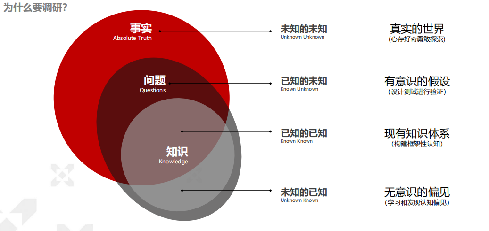
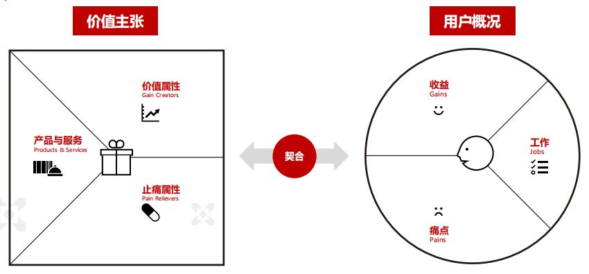
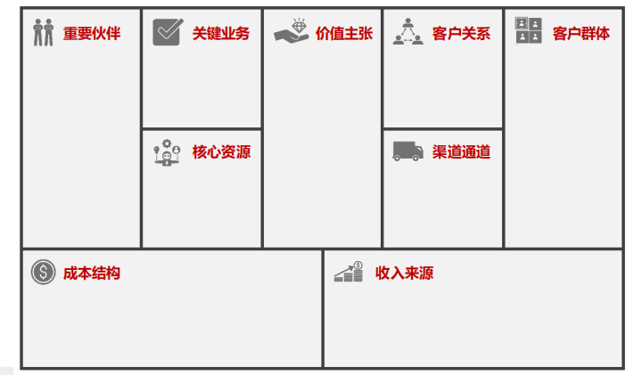
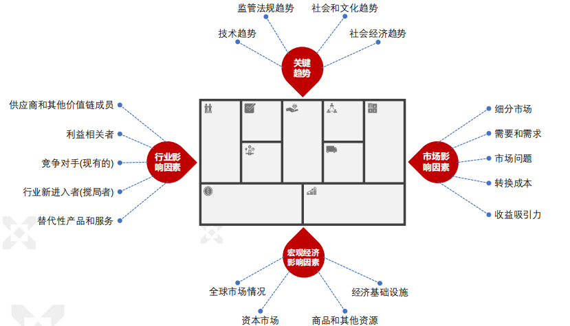
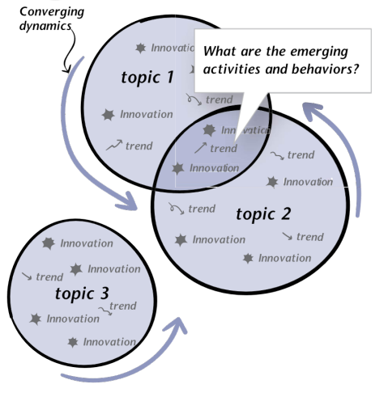

# 桌面调研

> Hall, E., & Stark, K. (2013). *Just enough research*. A Book Apart.
>
> Lanning, S., & Gerrity, C. (2022). *Concise guide to information literacy*. Bloomsbury.

## 调研

假设即风险，真实世界无法控制。

调研是从外接获取一些信息，对信息进行加工，变成知识。

当然，知识具有真伪性。当意识到自己的偏见（未知的已知）时，可以把它称为假设，然后再去构造实验去检验假设。

有的事情可能大家都这么去做，问题被自然的隐藏或者回避了，但是创业者要不断地去思考，通过测试手段来验证自己的想法，增加知识。

为什么要调研？

- 确定您是否在解决 **正确** 的 **问题** 
- 找出在系统中可能会 **阻碍** 您项目的 **stakeholder**
- 发现您最有 **竞争优势** 的地方
- 识别那些潜在有巨大影响力的 **小改变** （microtrends）
- 看到您自己的 **盲点** 和 **偏见** 如何阻碍您的决策
- 不是为了显得聪明
- 不是为了证明自己是对的
- 不是数据越多越好

反对调研？：

- 没有时间
- 没有专业知识
- 只有科学家才应该做研究
- 需要研究基础
- 可以在测试阶段找出所有问题
- 已经对问题非常了解
- 研究将改变项目的scope
- 研究将阻碍创新

真正的反对理由：

- 思维懒惰
- 怕被人证明是错的
- 喜欢和人交谈

## 实践

### 调研流程

1. 提出问题
2. 收集数据 <-> 处理数据
3. 提炼洞察

### 什么样的问题

- 生成性/探索性调研：关于……到底是什么一回事呢？
- 描述性/解释性调研：…… 是什么，…… 是如何工作的？
- 评估行调研：我们是否接近目标？
- 因果性调研：为什么会发生这种情况

### 问题格式

**Who/What/When/Where/Why/How/How much** + **Keywords**->**Topics**->**Disciplines**->**Fields**

所有的解决方案都是基于概念化的知识，而知识具有专业性，势必由专业的组织进行整理、研究和扩充。

当我们找到一个知识或者信息，就需要确认背后是什么组织在支撑其权威性。

### 什么样的数据

- 数据渠道（时效性/可靠性）
- 数据广度/数据深度

### 具体步骤

Step1：关键词选择

（宏观）领域名——>学科名——>主题名——>关键词（微观）

Step2：数据源选择（人文社科/市场行业/科学技术）

（时效性强+争议强）新闻—杂志—期刊—书—背景信息（时效性-常识）

Step3：触发问题（关于用户、需求、场景等）

（发散）探索性——>描述性——>验证性——>因果性（收敛）

Step4：进一步扩充关键词网络（重复第一步）

（宏观）领域名——>学科名——>主题名——>关键词（微观）

### 数据源

- 门户网站
  - Wired https://www.wired.com/
  - Tech crunch https://techcrunch.com/
  - The Verge https://www.theverge.com/
  - The Information https://www.theinformation.com/

- 市场行业报告
  - 发现报告 https://www.fxbaogao.com/
  - 洞见研报 https://www.djyanbao.com/
  - CB Insights https://www.cbinsights.com/
  - Gartner Research https://www.gartner.com/
  - McKinsey Research https://www.mckinsey.com/featured-insights

- 趋势报告

  - 百度指数 http://index.baidu.com/
  - Google Trends https://trends.google.com/trends/

- 人文/科技/商业分析评论类

  - MIT Technology Review https://www.technologyreview.com/
  - Harvard Business Review https://hbr.org/
  - Bloomberg https://www.bloomberg.com/
  - Financial Times https://www.ft.com/
  - The Economist https://www.economist.com/

- 砖家类

  - TED Talk https://www.ted.com/
  - Lex Fridman访谈 https://lexfridman.com/
  
- 科普专业类：

  - DK Science books https://www.dk.com/us/category/science-and-nature/
- MIT essential knowledge series https://mitpress.mit.edu/series/mit-press-essential-knowledge-series/
  - Rosenfeld Media Books https://rosenfeldmedia.com/books/
- Routledge Books https://www.routledge.com/

To C一般注重时效性、比较权威的科技评论的门户网站

门户网站可以去淘宝买廉价账号，行业报告+专门咨询

### 如何处理信息？

- How to use Google search engine? (Optional demo: Elderly Needs)
- How to read a paper? [Sci-Hub | How to read a paper. ACM SIGCOMM Computer Communication Review, 37(3), 83 | 10.1145/1273445.1273458](https://sci-hub.se/10.1145/1273445.1273458)
- How to read a book?[How to Read a Book: The Classic Guide to Intelligent Reading: Adler, Mortimer J., Van Doren, Charles: 9780671212094: Amazon.com: Books](https://www.amazon.com/How-Read-Book-Classic-Intelligent/dp/0671212095/)
- How to search patents?[Manage your work better and achieve your goals faster with monday.com. It's that simple.](https://www.youtube.com/watch?v=vr5aMjUTVOc)

## 框架性认知

> Osterwalder, A., Pigneur, Y., Bernarda, G., & Smith, A. (2015). *Value proposition design: How to create products* *and services customers want*. John Wiley & Sons.
>
> Osterwalder, A., & Pigneur, Y. (2010). *Business model generation: a handbook for visionaries, game changers,* *and challengers*. John Wiley & Sons.
>
> Kumar, V. (2012). *101 Design Methods: A Structured Approach for Driving Innovation in Your Organization*.

**框架性认识：**在理解事物或问题时，首先形成一个整体性的结构或框架，用于组织和理解其中的各个部分和要素。这种认识方式有助于将：

- 复杂的信息和概念系统化、归类和整合 (类似于数据抽象)

- 使人们更容易把握全局，

- 并且更有效地理解具体细节。

**例如：**

- 学术研究：在学术研究中，学者常常使用理论框架来组织和解释数据和研究结果。这些理论框架提供

了一个基本的结构，使得研究成果更容易被其他人理解和评估。

- 问题解决：在解决问题时，框架性认识可以帮助我们快速建立起解决问题的思路和步骤。它可以帮助

我们识别出问题的关键要素和相互之间的关系，从而更有针对性地采取行动。

- 决策制定：在面对复杂的决策时，制定决策框架可以帮助决策者明确决策的目标、相关因素和可能的

影响，从而更加明晰地做出决策。

- 学习和教育：在教育领域，教师常常使用框架来帮助学生组织知识，建立知识体系，并促进对知识的

深入理解。

### 常用框架：价值主张画布

这里的工作是指为了实现某一目标、具有某一价值或者消除某一痛点。

### 常用框架：商业模式画布

### 常用框架：商业模式环境

### 常用框架：收敛图

**收敛图 (Convergence Map)** 通过：

- 扫描日常生活（工作生活、家庭生活、移动通信、交通出行等）
- 行业领域（机器人、AI、5G、AR/VR等）
- 其他主题的发展和创新趋势

从而关注不同主题汇聚形成的新增长点，预测新需求、新市场的产生。 该方法的核心思想是通过可视化方法，促进我们讨论用户的行为和态度如何在这些区域发生变化，并将它们视为创新机会的沃土。

