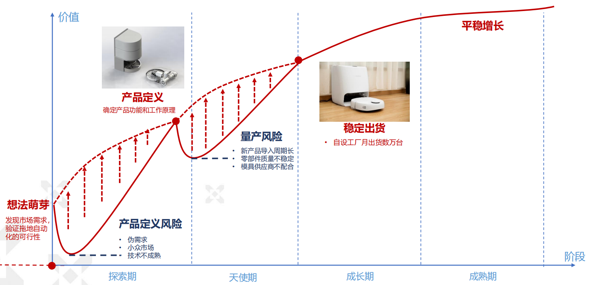
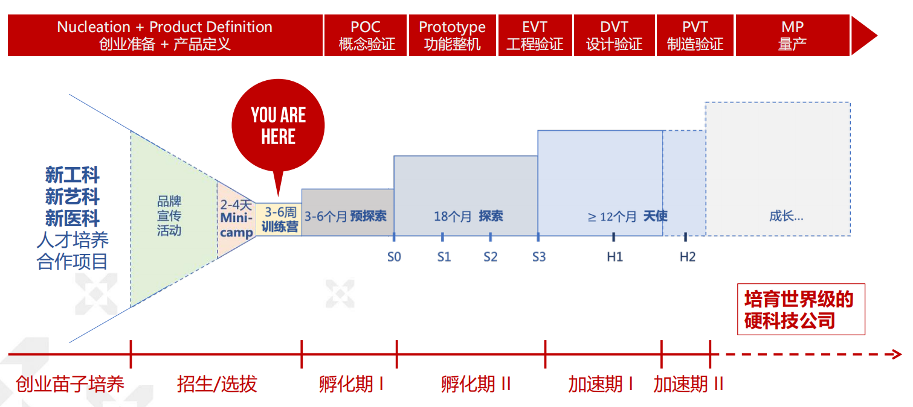
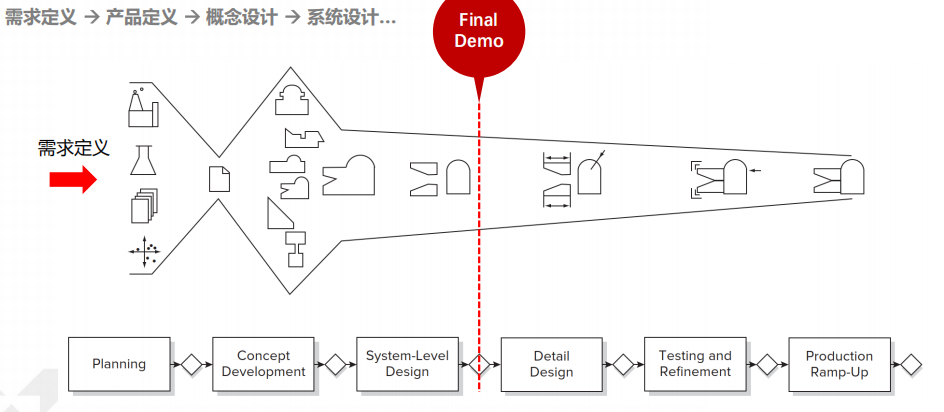
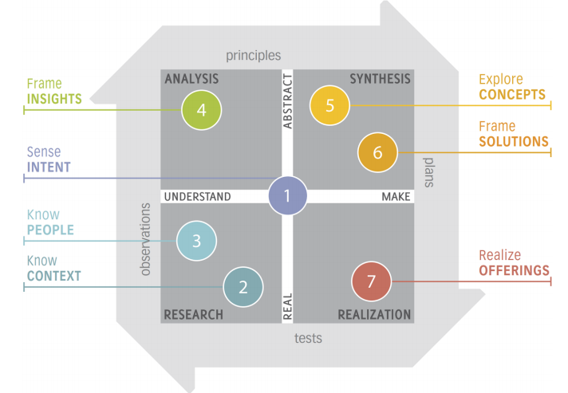

# 设计思维导入

设计团队在寻找问题的解决方案之前，首先花时间确定需要解决的根本问题，并考虑多种潜在解决方案，最终选出达成一致的方案。 这个过程称为设计思维。

——Don Norman, The Design of Everyday Things

## 创业流程简介

早期硬科技创业风险：产品定义风险和量产风险

> Ulrich, K. T., & Eppinger, S. D. (2016). *Product design and development*. McGraw-hill.

### 创业想法

> Aulet, B. (2024). *Disciplined Entrepreneurship: 24 Steps to a* *Successful Startup, Expanded & Updated*. John Wiley & Sons.

1. Who Is Your Customer?

2. What Can You Do for Your Customer?

3. How Does Your Customer Acquire Your Product?

4. How Do You Make Money off Your Product?

5. How Do You Design and Build Your Product?

6. How Do You Scale Your Business?

### 从调研开始

> Osterwalder, A., & Pigneur, Y. (2010). *Business model generation: a handbook for visionaries, game changers,* *and challengers*. John Wiley & Sons.

定义问题 <——> 解决问题

噪音/不确定性 到 规律/洞察 <——> 明晰/聚焦

像工程师喜欢定量，讨厌定性，抓住一个金点子，觉得这事行就行；这个事情就没有经过市场验证，容易带来风险。

在技术上创新难度非常大，但是前端——市场端——反而更容易创新。这就需要首先做好用户和市场的调研。

## 设计思维

> Norman, D. (2013). *The design of everyday things: Revised and expanded edition*. Basic books.
>
> Kumar, V. (2012). *101 Design Methods: A Structured Approach for Driving Innovation in Your Organization*.

- 以用户为中心
- 先需求，再解决方案
- 思维工具+思维方式转变

