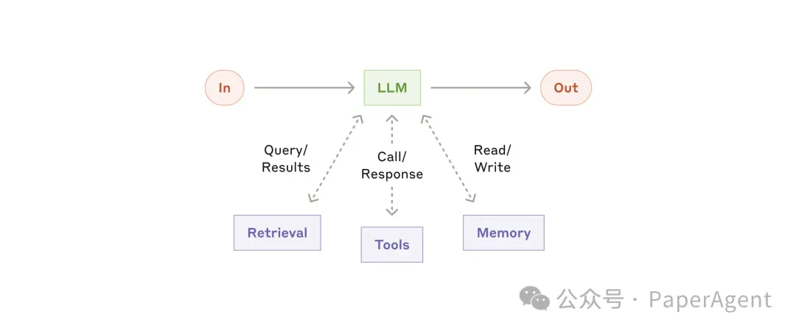
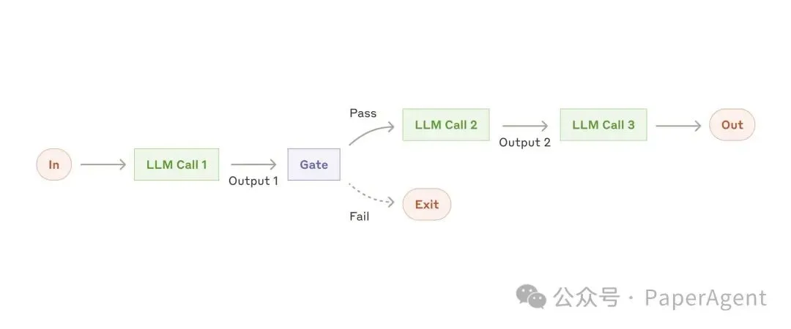
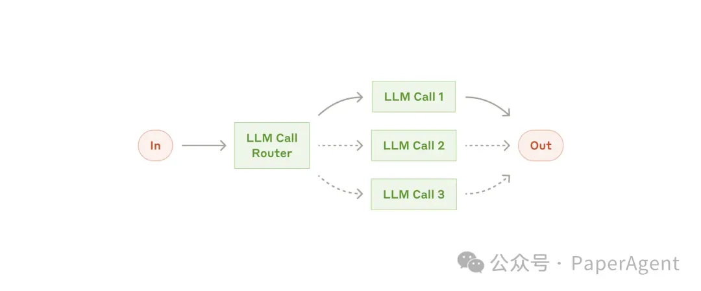
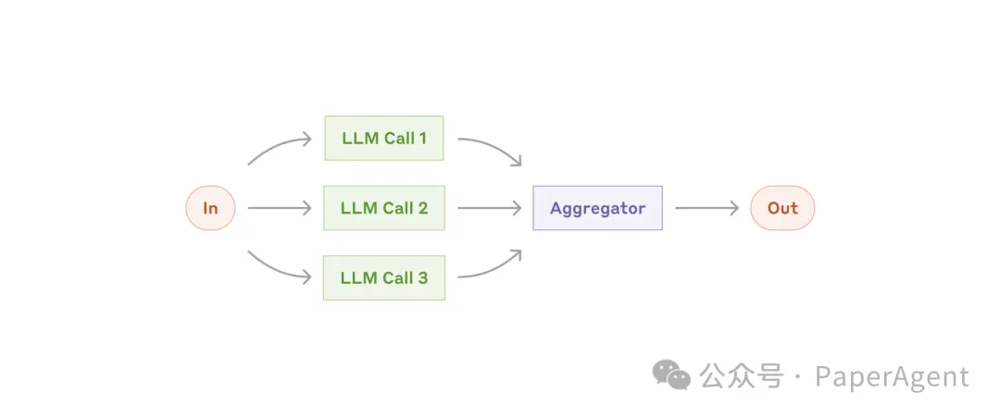
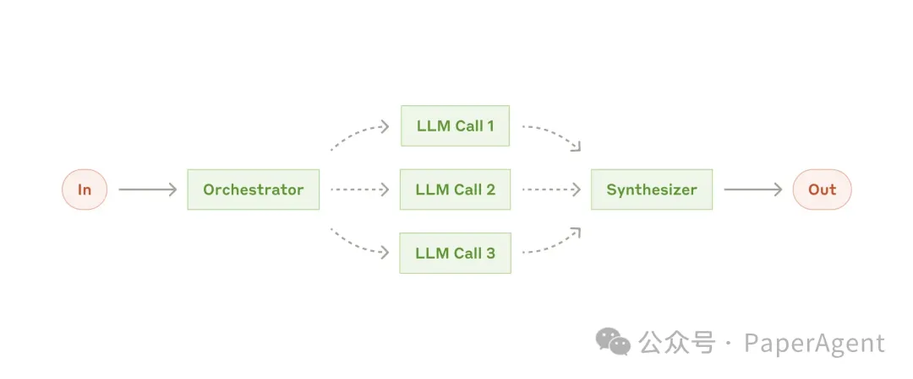
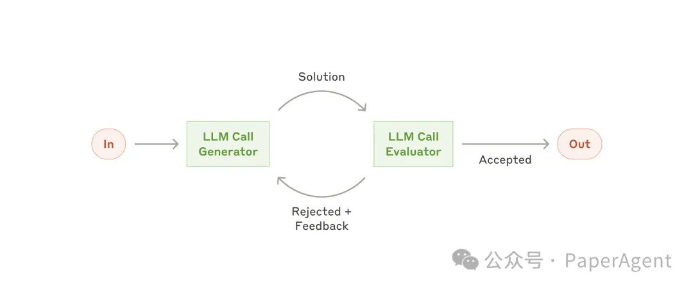
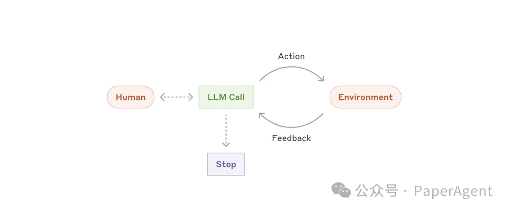

# 稍后阅读

## 人工智能从中小学抓起

> 原文：[人工智能教育从中小学抓起，你焦虑了吗？一场关乎未来的教育变革](https://mp.weixin.qq.com/s/76MHQe0dyB3fBPmQ1UKr_w)

### 摘要&关键信息

2024年11月18日，教育部办公厅印发了《关于探索中小学人工智能教育实施途径的通知》，探索中小学人工智能教育实施途径，加强中小学人工智能教育。标志着我国中小学人工智能教育进入新的发展阶段。

教育部义务教育信息科技课程标准专家组组长熊璋教授接受央视访谈，主要讨论了加强中小学人工智能教育的总体要求与具体部署。关键信息内容如下：

- 人工智能教育要满足面向未来的创新型人才培养需求，强调学用结合，培养学生科学兴趣和科学精神，提升数字素养与数字技能。
- 小学低年级段侧重感知和体验人工智能技术，小学高年级段和初中阶段侧重理解和应用人工智能技术，高中阶段侧重项目创作和前沿应用。
- 人工智能课程的推行绝不能重走应试教育的老路，而应该是一条新路，是学生愉快的学习，创造性的学习，享受学习的一种场景。
- 人工智能的学习，没有机会再卷题目，没有机会再卷考试了，完全是要看他的真本领、真能力。
- 发挥中小学的积极性，发挥大学的积极性，发挥研究院所的积极性，发挥企业的积极性，是一条正确的道路。

## Building effective agents

> 原文：[Building effective agents \ Anthropic](https://www.anthropic.com/research/building-effective-agents)
>
> 中文翻译：[Anthropic最新：AI Agents 2024年度总结！](https://mp.weixin.qq.com/s/onLByvapFe-rzaeryf5vUw)

### 什么是Agents？

在 Anthropic，我们将所有这些变体归类为Agent系统，但在**工作流程和Agent**之间划出了一个重要的架构区别：

- 工作流是通过预定义的代码路径协调 LLM 和工具的系统。
- 另一方面，Agent是 LLM 动态指导其自身流程和工具使用情况的系统，从而保持对其完成任务的方式的控制。

### 何时（以及何时不使用）使用Agent

Agent系统通常会牺牲延迟和成本来换取更好的任务性能，您应该考虑这种权衡何时是合理的。

当需要更多复杂性时，工作流可以为明确定义的任务提供可预测性和一致性，而当需要大规模灵活性和模型驱动的决策时，Agent是更好的选择。

### 构建块、工作流和Agent

**Agent系统的常见模式**。我们将从基础构建块（增强型 LLM）开始，并逐步增加复杂性，从简单的组合工作流到自主Agent。

#### 构建模块

**构建模块：增强型 LLM**

Agent系统的基本构建块是 LLM，它通过检索、工具和记忆等增强功能得到增强。

#### 工作流程

**工作流程：提示链接**

提示链将任务分解为一系列步骤，其中每个 LLM 调用都会处理前一个调用的输出。您可以在任何中间步骤上添加程序检查（参见下图中的“门”），以确保流程仍在正常进行。

何时使用此工作流程：此工作流程非常适合可以轻松、干净地将任务分解为固定子任务的情况。主要目标是通过使每次 LLM 调用都成为更简单的任务，以牺牲延迟换取更高的准确度。

提示链有用的示例：

- 生成营销文案，然后将其翻译成不同的语言。
- 撰写文档大纲，检查大纲是否符合某些标准，然后根据大纲撰写文档。

**工作流程：路由**

路由将输入分类并将其定向到专门的后续任务。此工作流程允许分离关注点并构建更专业的提示。如果没有此工作流程，针对一种输入进行优化可能会损害其他输入的性能。

何时使用此工作流程：路由适用于复杂任务，其中存在不同的类别，最好分别处理，并且可以通过 LLM 或更传统的分类模型/算法准确处理分类。

路由有用的示例：

- 将不同类型的客户服务查询（一般问题、退款请求、技术支持）引导到不同的下游流程、提示和工具中。
- 将简单/常见问题路由到较小的模型（如 Claude 3.5 Haiku），将困难/不寻常的问题路由到功能更强大的模型（如 Claude 3.5 Sonnet），以优化成本和速度。

**工作流程：并行化**

LLM 有时可以同时执行一项任务，并以编程方式汇总其输出。这种工作流程（并行化）体现在两个关键变化中：

- 分段：将任务分解为并行运行的独立子任务。
- 投票：多次运行相同的任务以获得不同的输出。

何时使用此工作流程：当划分的子任务可以并行化以提高速度，或者当需要多个视角或尝试以获得更高置信度的结果时，并行化是有效的。对于具有多个考虑因素的复杂任务，当每个考虑因素由单独的 LLM 调用处理时，LLM 通常会表现得更好，从而可以集中注意力于每个特定方面。

并行化有用的示例：

- **切片**：

- - 实施护栏，其中一个模型实例处理用户查询，而另一个模型实例则筛选不适当的内容或请求。这往往比让同一个 LLM 调用处理护栏和核心响应效果更好。
  - 自动评估 LLM 性能，其中每个 LLM 调用都会根据给定提示评估模型性能的不同方面。

- **投票**：

- - 审查一段代码是否存在漏洞，其中几个不同的提示会审查该代码，如果发现问题则标记该代码。
  - 评估给定的内容是否不适当，使用多个提示评估不同的方面或需要不同的投票阈值来平衡误报和误报。

**工作流程：Orchestrator-workers**

在 orchestrator-workers 工作流中，中央 LLM 动态地分解任务，将其委托给 worker LLM，并综合其结果。

何时使用此工作流程：此工作流程非常适合无法预测所需子任务的复杂任务（例如，在编码中，需要更改的文件数量以及每个文件中更改的性质可能取决于任务）。虽然它在拓扑上相似，但与并行化的主要区别在于其灵活性 - 子任务不是预先定义的，而是由编排器根据特定输入确定。

orchestrator-workers 有用的示例：

- 每次对多个文件进行复杂更改的编码产品。
- 搜索任务涉及收集和分析来自多个来源的信息以获取可能相关的信息。

**工作流程：评估器-优化器**

在评估器-优化器工作流中，一个 LLM 调用生成一个响应，而另一个调用在循环中提供评估和反馈。

何时使用此工作流程：当我们有明确的评估标准，并且迭代改进提供可衡量的价值时，此工作流程特别有效。良好契合的两个标志是，首先，当人类表达他们的反馈时，LLM 的响应可以明显改善；其次，LLM 可以提供这样的反馈。这类似于人类作家在制作精美文档时可能经历的迭代写作过程。

评估器-优化器有用的示例：

- 文学翻译中存在译者 LLM 最初可能无法捕捉到的细微差别，但评估者 LLM 可以提供有用的批评。
- 复杂的搜索任务需要多轮搜索和分析才能收集全面的信息，然后评估人员决定是否有必要进行进一步搜索。

#### 智能体Agents

随着 LLM 在关键功能（理解复杂输入、进行推理和规划、可靠地使用工具以及从错误中恢复）方面的日趋成熟。

- 智能体通过人类用户的命令或与人类用户的互动讨论开始工作。
- 一旦任务明确，智能体就会独立规划和操作，并可能返回人类那里获取更多信息或判断。
- 在执行过程中，智能体必须从每个步骤（例如工具调用结果或代码执行）的环境中获得“基本事实”以评估其进度。
- 然后，智能体可以在检查点或遇到阻碍时暂停以等待人类的反馈。
- 任务通常在完成后终止，但通常也会包含停止条件（例如最大迭代次数）以保持控制。

**智能体可以处理复杂的任务，但它们的实现通常很简单**。它们通常只是使用基于环境反馈的工具的 LLM。因此，清晰、周到地设计工具集及其文档至关重要。

**何时使用智能体**：智能体可用于开放式问题，在这些问题中，很难或不可能预测所需的步骤数，并且您无法硬编码固定路径。LLM 可能会运行很多轮，您必须对其决策有一定程度的信任。智能体的自主性使其成为在受信任环境中扩展任务的理想选择。

智能体的自主性意味着更高的成本，以及出现复合错误的可能性。我们建议在沙盒环境中进行广泛的测试，并采用适当的防护措施。

**智能体有用的例子：**

- 一个编码智能体，用于解决SWE-bench 任务，该任务涉及根据任务描述对许多文件进行编辑；
- 我们的“计算机使用”参考实现，其中 Claude 使用计算机来完成任务。

编码智能体的高级流程：

### 组合和定制这些模式

这些构建块不是规定性的。它们是开发人员可以塑造和组合以适应不同用例的常见模式。与任何 LLM 功能一样，成功的关键是衡量性能和迭代实现。重复一遍：*只有*当它明显改善结果时，您才应该考虑增加复杂性。

### 总结

**在实施智能体时，我们尝试遵循三个核心原则**：

1. 保持智能体设计的简单性。
2. 通过明确展示智能体的计划步骤来优先考虑透明度。
3. 通过全面的工具文档和测试精心设计您的智能体-计算机接口 (ACI) 。

框架可以帮助您快速入门，但在投入生产时，请毫不犹豫地减少抽象层并使用基本组件进行构建。

## 留守儿童心理健康筛查的多Agent多模态系统

> 原文：[[2412.14769\] PsyDraw: A Multi-Agent Multimodal System for Mental Health Screening in Left-Behind Children](https://arxiv.org/abs/2412.14769)

## AI+教育

> 异步学习（asynchronous learning）是一种教育学名词，指的是学习者与指导者，或者学习者之间进行非实时双向交流的学习活动方式。

广播电视教育（1980年代起）：

- 技术支撑：无线电技术、电视转播技术
- 学习资源：有限的视频、音频
- 交互方式：异步学习、几乎无互动
- 个性学习：不支撑个性化学习

大规模在线课程（2010年代起）：

- 技术支撑：网络技术、多媒体技术
- 学习资源：大量可学习视频、音频
- 交互方式：异步学习、有限讨论区互动
- 个性学习：有限个性化学习

在线直播课程（2020起）：

- 技术支持：4G、5G技术，大数据技术
- 学习资源：视频音频直播流、录像
- 交互方式：同步学习、有限文字互动（弹幕等）
- 个性学习：少量个性化辅学（课程推荐等）

未来构想：构建全AI大模型守护授课的自适应课堂，促进知识个性化沉浸式传播

- 教师全智能辅助：大模型辅助教师完成课程准备，包括课件PPT辅助制作、课程讲解脚本自动生成等一系列功能。
- 课堂个性定制化：课堂包括教师、助教、虚拟同学等大模型智能体，实现学生体验式学习以及课堂定制化。

