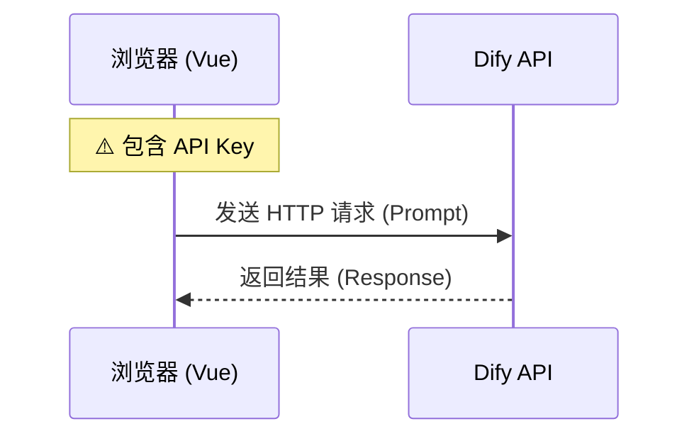
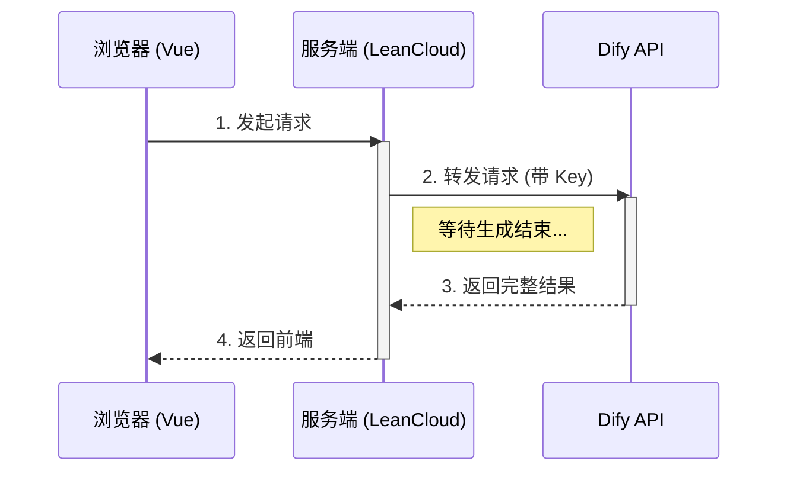
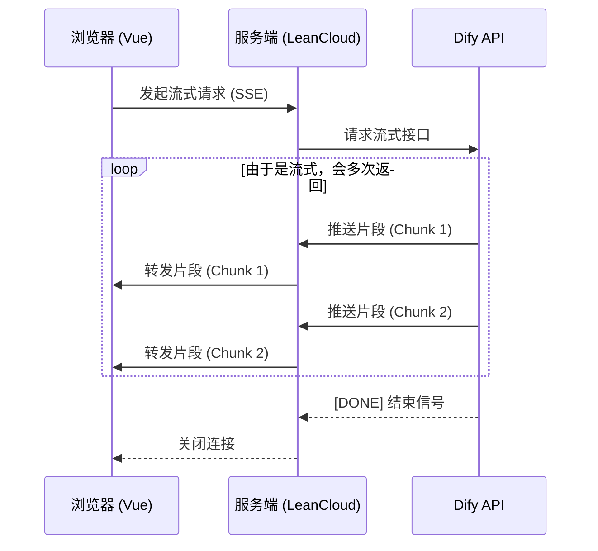
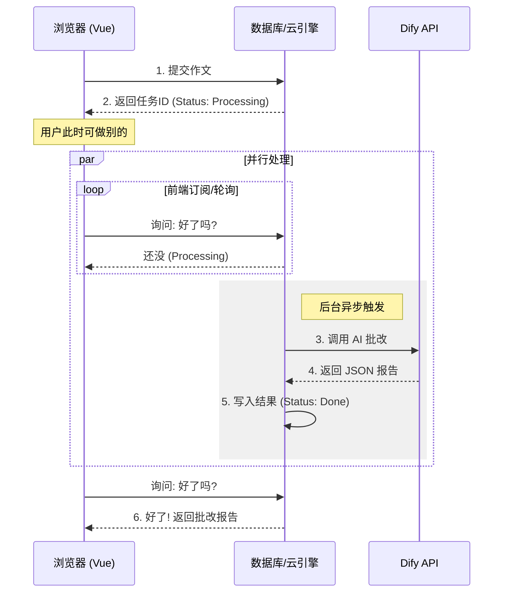
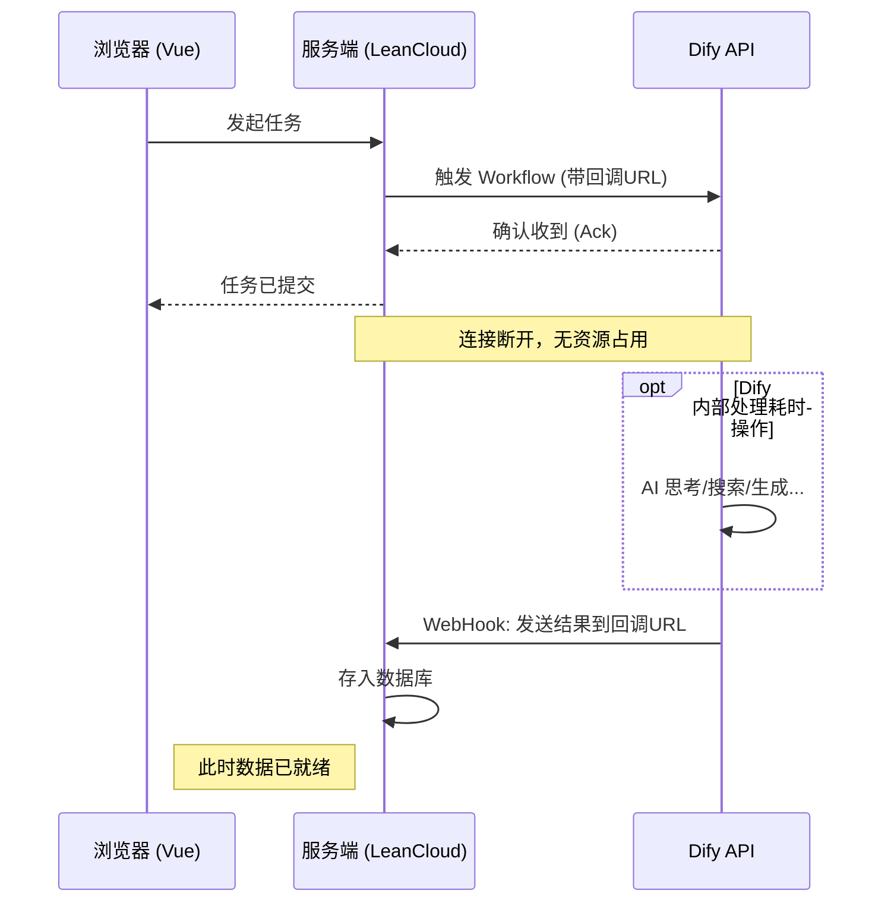
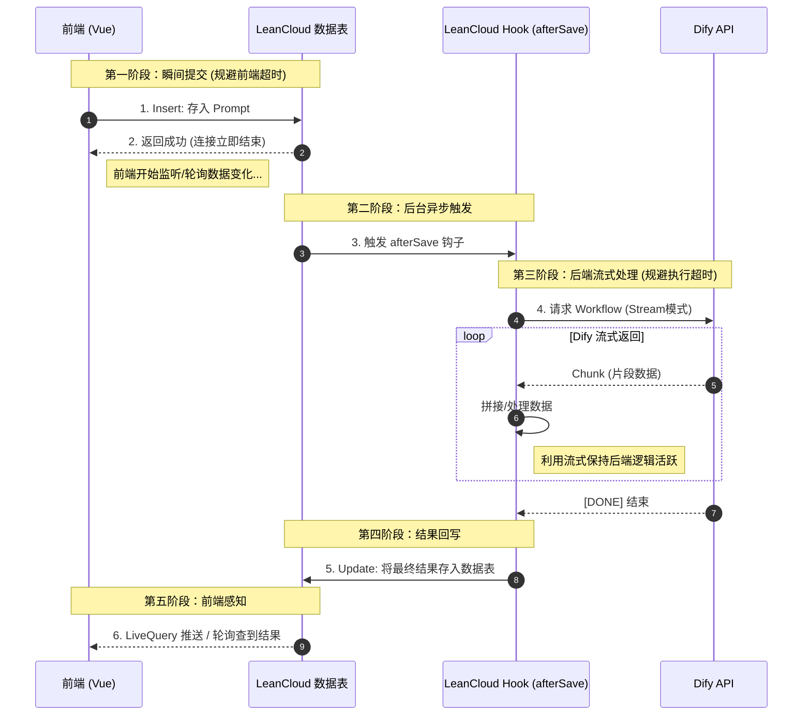

# LLM Interaction Patterns：应对 AI 高延迟特性的 5 种交互策略

### 1. 背景与挑战

最近在做一个AI的应用，是基于Dify平台完成了AI部分的搭建，应用的大致开发思路是：Vue3完成前端开发、LeanCloud负责后端函数与数据库调用、Dify提供API完成AI相关的业务。

一开始的DEMO为了方便，直接在前端完成了与Dify的交互，但这一开发模式很糟糕（下文也会提到）：

- 前端必需一直保持稳定的连接，要是用户关闭网页、连接有波动等就会导致数据丢失，鲁棒性很差
- 密钥容易暴露
- ……

为了改进架构，决定使用LeanCloud的云函数，实现“后端而非前端”的调用。开发过程中遇到了CloudFare 100s的TIMEOUT……

---

### 2. 五种主流交互模式架构

#### 模式 I：直连模式 (Client-Side Direct)

- **拓扑:** `Client` $\rightarrow$ `LLM Provider`
- **机制:** 前端直接发起 HTTP 请求。
- **缺点:** **致命的安全隐患**（API Key 必定暴露）。
- **适用场景:** 仅限本地 Demo、个人快速原型验证。**生产环境严禁使用**。

#### 模式 II：同步代理模式 (Synchronous Backend Proxy)

- **拓扑:** `Client` $\rightarrow$ `Server (BFF)` $\rightarrow$ `LLM`
- **机制:** 服务端作为中转，隐藏 Key。客户端发请求挂起等待，服务端拿到完整结果后一次性返回。
- **优点:** 架构简单，易于实现。
- **缺点:** 受制于 HTTP 超时限制（通常 60s）；用户体验差（长时间白屏/Loading）。
- **适用场景:** 短文本生成、简单的分类任务、指令型操作。

#### 模式 III：流式管道模式 (Streaming Proxy / SSE)

- **拓扑:** `Client` $\leftrightarrow$ `Server` $\leftrightarrow$ `LLM` (Keep-Alive)
- **机制:** 利用 **SSE (Server-Sent Events)** 或 **WebSocket**。服务端收到 LLM 的 Chunk（数据块）后，立即通过管道透传给前端。
- **优点:** **TTFB (Time to First Byte)** 极低，即时反馈感强，缓解用户等待焦虑。
- **缺点:** 此时很难处理复杂的结构化数据（如 JSON），更适合纯文本流。
- **适用场景:** Chatbot、即时写作助手、翻译。

#### 模式 IV：异步任务队列模式 (Async Task Queue)

- **拓扑:** `Client` $\rightarrow$ `Server` $\rightarrow$ `DB/Queue` ... `Worker` $\rightarrow$ `LLM`
- **机制:**
    1. **提交:** 客户端提交请求，服务端仅返回 `TicketID`（任务单号）。
    2. **处理:** 后台 Worker 异步调用 LLM，完成后更新数据库状态。
    3. **获取:** 客户端通过 **轮询 (Polling)** 或 **订阅 (Pub/Sub)** 获取结果。
    
- **优点:** **最稳健**。解耦了请求与处理，不受超时限制，支持断点续传和历史记录持久化。
- **适用场景:** 长文本分析、复杂 Workflow、生成报告、批量处理（如作文批改）。

#### 模式 V：WebHook 回调模式 (Reverse Call)

> 因为Dify没有此功能，遂作废。

- **拓扑:** `Client` $\rightarrow$ `Server` $\rightarrow$ `LLM`;  `LLM` $\rightarrow$ `Server`
- **机制:** 触发 LLM 任务后立即断开。LLM 处理完成后，主动向预留的 Server URL 发送结果。
- **优点:** 节省服务端并发连接资源。
- **缺点:** 依赖 LLM 平台支持（如 Dify Workflow），本地开发调试较麻烦（需内网穿透）。
- **适用场景:** 极长耗时任务、自动化工作流集成。

---

### 3. 架构决策树 (Decision Matrix)

在做架构选型时，请遵循以下判断逻辑：

1. **是否不仅是 Demo？**
  
    - 否 $\rightarrow$ 模式 I (直连)    
    - 是 $\rightarrow$ 继续
    
2. **任务平均耗时是否 < 5秒？**
  - 是 $\rightarrow$ 模式 II (同步代理)
    - 否 $\rightarrow$ 继续
  
3. **是否需要输出结构化数据（JSON/Report）？**
  
    - 否 (纯聊天) $\rightarrow$ 模式 III (流式 SSE)
    - 是 (如批改报告) $\rightarrow$ **模式 IV (异步任务)**
    
4. **是否有极高的并发连接压力且任务极慢？**
  
    - 是 $\rightarrow$ 模式 V (WebHook)

---

### 4. 我最终的架构方案

1. **前端 (Frontend):**
   - 用户点击发送，前端直接向 LeanCloud 数据表**插入一条数据**。
   - **关键点：** 这个请求是瞬间完成的（Standard HTTP POST），**Cloudflare 根本没有机会超时**。前端立即进入“监听/轮询”状态。
2. **LeanCloud 后端 (Trigger):**
   - LeanCloud 数据库监测到新写入，自动触发 **`afterSave` Hook 函数**。
   - 函数开始执行业务逻辑。
3. **后端与 Dify 的交互 (Server-Side Streaming):**
   - Hook 函数向 Dify 发起请求，**开启 Stream 模式**。
   - **这里的“流”是为了后端保活：** 虽然前端连接断了，但 LeanCloud 云函数本身也有执行时长限制（通常是几分钟）。通过接收 Dify 的流式 Chunk，可以确保函数不会被判定为死锁，同时能更快地拿到数据碎片。
4. **数据回传 (Sync/Update):**
   - **可选方案 (最丝滑 - LiveQuery):** Hook 函数每收到 Dify 的一段话，就更新一次数据库记录。前端通过 WebSocket (LiveQuery) 实时看到字一个个蹦出来。
   - **当前方案 (最常见 - 最终更新):** Hook 函数把 Dify 的流攒完，最后一次性 `Update` 数据库。前端轮询发现状态变了，展示结果。

**优点 (Pros):**

1. **彻底消灭前端超时：** 因为前端只负责“存数据”，耗时仅几十毫秒，Cloudflare 的 100s 限制对你完全无效。
2. **鲁棒性极强：** 哪怕用户存完数据就把网页关了，后台的 AI 任务依然会跑完，结果依然会存在数据库里，下次打开还能看到。
3. **架构清晰：** 利用数据库作为唯一的“状态源之源 (Source of Truth)”。

**挑战 (Cons):**

1. **流式体感实现复杂：** 如果想要前端像 ChatGPT 那样“打字机”式蹦字，需要后端 Hook 极其频繁地更新数据库（写压力大），配合 LiveQuery。
2. **并发锁问题：** 多个 Chunk 同时更新同一行数据库记录时，需要注意版本冲突。