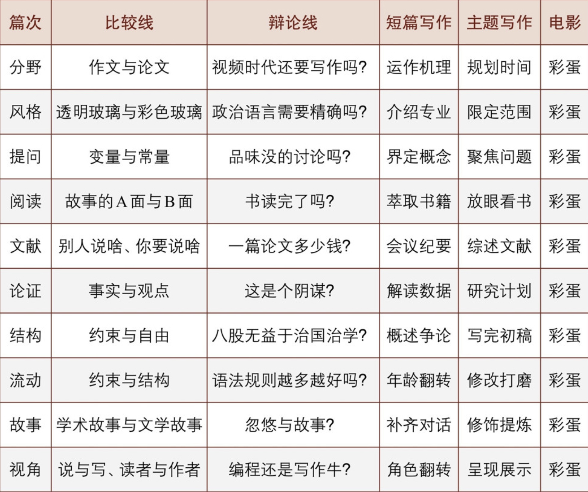

> **《写作是门手艺》** - 刘军强

- 学术研究的有些环节是不可教的，比如论文的构思，我认为不可教。论文写作可教，但很难教。
- 一篇好论文，是恰当的词出现在恰当的句子中，恰当的句子出现在恰当的段落中，恰当的段落出现在恰当的结构中。

# 第一篇 分野：作文与论文

## 摘抄

###  **第1章 思维的成人礼**

- 作文和论文的区别，表面上是两种文体的不同，内里折射着两种学习方式的差异，深层则对应着基础教育和高等教育之间的结构性断裂。
- - 作文是习作，七八百字即最高篇幅；写论文要有创见，通常几千上万。
  - 作文主要是表达自我，论文则需要明确的观点并予以论证。
  - 作文多为命题，全班同学经常写同一个题目；论文题目则要学生自己寻找，不确定性会带来焦虑。
  - 作文以应试为导向，一般速战速决；论文则耗日持久且需要多次修改，挑战耐力。
  - 作文通常是闭卷完成；而论文则是开卷作业，学生需要“上穷碧落下黄泉，动手动脚找东西”。闭卷考试，似难实易；开卷写作，似易实难。
  - 咱们从小学开始练了十几年作文，有成堆辅导书和辅导班；大多数学生上了大学后才知道有论文这回事。
  - 作文通常有范文，跑题会得低分；论文没有标准答案，讲求标新立异、自圆其说。
- - 中小学以应试为主，重视刷题；大学一般不再填鸭，注重独立思考。
  - 考试是中小学的主要考核形式，简答论述题导致学生们养成罗列要点式的思维方式；大学生得自己发现并解决问题。中学老师常问：记住了吗？大学老师则会问：你怎么看？
  - 中小学学习高度结构化，连睡觉和吃饭等生理时间都是规定好的；而大学教育则假定你是一个成年人，所以基本没有人管你。
  - 中小学生活在父母的期望中（考上好大学）；到了大学，学生的自我意识复苏，开始为自己而活。
  - 中小学老师几乎是监护者的角色，而大学老师则像是疏远的朋友或者最熟悉的陌生人。你会担心中学老师经常找你，但大学里你经常找不到老师，见面通常需要预约。
  - 中小学学生完全是知识消费者，而大学生尤其是硕士、博士研究生则需要承担一部分知识生产的责任。
- 中国这种超大规模的赶超型国家，不得已维持闭卷考试为特点的考核体系，以维持社会流动的公平。高考已经成为社会公平的一个重要试金石。如果推行灵活的选才机制，各种“花样”都可能冒出来，反而影响大家对教育体系的信心。

###  **第2章 写作：学业和事业起飞的火箭燃料**

- 大学写作训练通常分为两类：创意写作(creative writing)与说理写作(exposi-tional writing)。创意写作通常面向小说、诗歌、戏剧、剧本等文体。而说理写作则面向论文、实验记录、调查报告、文献述评等文体。大学阶段最重要的学习任务是能写有根有据、有问题有论证、结构完整的论文。 本书侧重于说理写作，这类写作以分析和解释为主要目的。说理写作不介意寡淡的白描，不主张圆滑的含混，不裹挟冲动的杂质，而是仔细倾听理性的声音。
- 大学写作训练通常分为两类：创意写作(creative writing)与说理写作(exposi-tional writing)。创意写作通常面向小说、诗歌、戏剧、剧本等文体。而说理写作则面向论文、实验记录、调查报告、文献述评等文体。大学阶段最重要的学习任务是能写有根有据、有问题有论证、结构完整的论文。
- 说理写作背后是一套复杂的思维能力：敏锐的观察和提问能力、资料搜集与消化能力、抽丝剥茧的分析与论证能力、化无形为有形的整合能力、以读者为中心的共情和沟通能力。
- 《纽约时报》刊文曰：“人与人的接触正成为一种奢侈品。对于人际关系的处理能力，未来也许会成为新的身份标志和地位象征。
- 如果一个学生只是“听话、出活”但不善沟通，将无法适应现代社会的激烈竞争。

###  **第3章 怎样使用这本书？**

- “比较差异、寻找机制”的变量思维贯串每一篇。写作涉及多重能力的培养，其核心是思维能力。
- 其次，每篇结束后的“想·写·作”也是一条连贯的线索。
- 现代人注意力碎片化，既没时间读长篇大论，更没时间写冗长的文字，我建议用三五百字锻炼短篇写作能力：围绕一系列主题，每篇不要超过300字，最多不能超过500字。
- 我借鉴了普林斯顿大学和清华大学写作课中的主题写作，用一个话题穿起分阶段的连贯写作：家。
- 我建议你采取两个角度来锻炼写作：一个是本学科角度，一个是陌生角度。如果你学历史，我建议你从家庭演变的角度写一篇文章；此外，我建议你挑战一下自己，探索一个陌生角度。例如，你可以从建筑的角度写一篇家庭物质环境的文章。
- 正如史蒂夫·马丁所言：“所有人生的谜语都可以从电影找到答案。”
- 


##  **练习·电影·阅读**


 > 1.辩论。现在还需要写作吗？这是一个读图的时代、看视频的时代、注意力碎片化的年代，文字似乎已经失去了读者。有人认为，可视化才是最应该学习的技能（所谓的“视觉素养”）。

```
显然是需要的。“写作似乎已经失去了读者”，是在指大家以往通过文字获得启发、慰藉、情绪价值等体验，现在可由其他载体更好的或者说更有意思的载体实现，因此大家本给文字的注意力逐渐转移到了其他事物上。可是，文字具有根本的不可替代性，所以任何读者总会在某一特定场地需要且唯一需要文字，诸如科研工作者需要借助论文来精确地交流学术思想，法律专业人士依赖严谨的合同文本来界定权责……可视化固然当前时代下值得推崇的手段，可我们有理由相信，写作和文字才是表达的根本，或许更准确的说法是，许多复杂的视觉叙事仍需文字作为锚点来避免歧义，而文字的深度和精确性使其在某些表达上具有独立优势。
```

 > 2.辩论。理科生需要学写作吗？术业有专攻，理科生能解出方程、写出代码、算出系数、做出实验不就可以了吗？你怎么看？

```
写作是理科生精准表达、传播和交流想法的必备工具。值得注意的是，这里的写作的概念：一份结构清晰的实验报告、撰写一份逻辑严密的专利申请、或者注释一段可读性极高的代码，这些才是他们世界里的“写作”。这种写作的核心是逻辑、结构和清晰度，而非文采、修辞和情感共鸣。所以，他们需要学的不是“大写作”，而是“技术沟通”这门手艺。
```

 > 3.短篇写作。解释事物运作机理，可以是一个APP，一种游戏，一项运动，一件乐器，一种机械，一样饭菜……把事情讲清楚，说起来容易但其实是极难练就却极端重要的能力。要求：(1)条理清晰，能让人看完就明白；(2)吸引读者，能让不感兴趣的人产生兴趣。

```
// Version 1
讲讲AI中的MCP——模型上下文协议（Model Context Protocol）。
在我们使用AI过程中，要是想让其帮我们分析Excel表格中的学生成绩，AI模型就会利用这套协议对Excel发挥指令，Excel也会返回相关结果给AI。在这个过程中，Excel是相对于AI的外部工具，MCP协议让AI与Excel交流成为可能。
总之，为了让这份协议成功地发挥效力，需要三名主体的配合：AI模型，工具，以及连接他俩的应用程序。
工具需要提供：

* 使用说明书：名称、描述、需要给工具输入什么
* 回执单：工具有没有使用成功？成功的话，返回了什么结果。
  AI模型需要像人一样仔细阅读工具的使用说明书，并按照说明书填写给工具的请求单。
  而应用程序就像项目经理，负责把请求单、说明书、回执单在AI模型和工具之间传递，并会监督整个过程。
  以上就是MCP实现的机制。
* 讲讲AI中的MCP——模型上下文协议（Model Context Protocol）。
  在我们使用AI过程中，要是想让其帮我们分析Excel表格中的学生成绩，AI模型就会利用这套协议对Excel发挥指令，Excel也会返回相关结果给AI。在这个过程中，Excel是相对于AI的外部工具，MCP协议让AI与Excel交流成为可能。
  总之，为了让这份协议成功地发挥效力，需要三名主体的配合：AI模型，工具，以及连接他俩的应用程序。
  工具需要提供：
  * 使用说明书：名称、描述、需要给工具输入什么
  * 回执单：工具有没有使用成功？成功的话，返回了什么结果。

AI模型需要像人一样仔细阅读工具的使用说明书，并按照说明书填写给工具的请求单。而应用程序就像项目经理，负责把请求单、说明书、回执单在AI模型和工具之间传递，并会监督整个过程。

以上就是MCP实现的机制。
```

```
// Version 2
我们常用AI，感觉它像个无所不知的朋友，但又好像被关在“小黑屋”里——它会聊天，却没法帮你点外卖、分析Excel表格。

怎么才能让它走出小黑屋，指挥其他软件干活呢？答案是一套高效的“沟通协议”。我们可以把它想象成一个职场法则，里面有三个角色：

- **AI模型**：聪明但被隔离的“总监”。
- **外部工具**（如Excel）：有特定技能的“专家”。
- **你用的App**：负责沟通的“项目经理(PM)”。

现在，假设“AI总监”接到了一个任务：**“找出Excel表格里所有不及格的学生名单。”**

整个流程就像这样：

1. **下达意图**：AI总监对项目经理说：“我需要一份不及格名单”
2. **提供“员工手册”**：项目经理立刻递上“Excel专家”的使用说明书：
   - 【姓名】：Excel
   - 【特长】：数据分析、图表制作
   - 【如何交给他任务】：请给我清晰的指令，比如“筛选出‘成绩’一列中小于60的行”。
3. **填写“工作单”**：AI总监阅读了说明书，随后填写了一份标准的工作请求单：“请对文件xxx.xlsx，执行筛选操作：‘成绩’列 < 60”。
4. **传达指令**：项目经理拿着这张工作单，把任务交给Excel专家去执行。
5. **返回结果**：Excel专家完成任务后，把一份包含所有不及格学生名单的新表格，连同一张“任务完成”的回执单，交还给项目经理。
6. **向上汇报**：最后，项目经理将这份成果报告交给总监。

通过这套“看说明、开工单、交任务、收成果”的流程，AI总监就成功“指挥”了外部专家，完成了自己办不到的事。

这个让AI学会“摇人”干活的沟通法则，其技术名称就叫**模型上下文协议（Model Context Protocol, MCP）**。

正是它，让AI未来能调用计算器、搜索引擎、订票软件……真正成为能深入我们生活和工作的超级助理。
```

