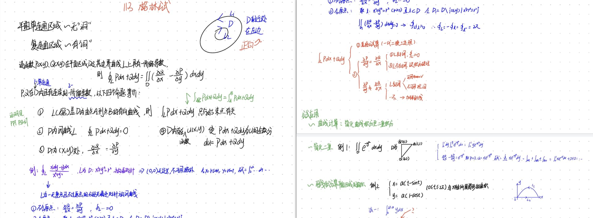
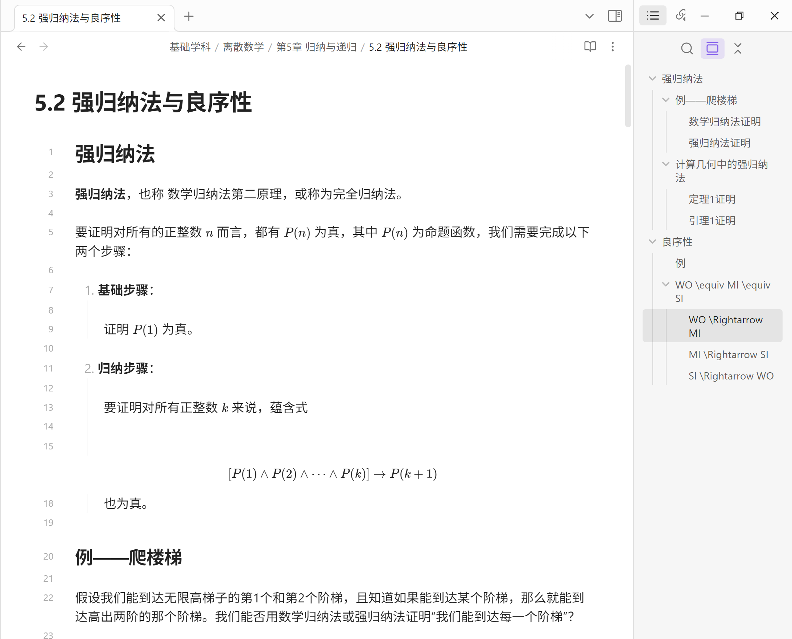

## 问题

> 准大二-自动化，回顾了下上学期学习数学的过程，包括课程计划内的高数和自学的离散，就“数学笔记“这一话题有些思考和疑惑，与佬友们共勉。

**本贴讨论的核心命题：什么是有效的数学笔记？并基于此思考，什么是有效的理工科笔记？**

在正式开始讨论前，先确定对”有效“的概念。

站在自动化这一工科专业的背景下，我认为数学对于该专业的作用，不是理论性的，而是实践性的。有效，即意味着能够帮助“把数学运用于实践”。

---

先来讨论，从结果上来看，什么是“有效的数学学习”。

私以为，分为两部分：

- 深入透彻的概念理解
- 强大灵活的实践运用

那么，数学笔记在这其中应当发挥什么样的作用呢？笔记本身肯定不能帮我们理解，因为理解的发生在于大脑深处，理解不是“获取了一种信息”，更像是大脑中“浮现了一种智慧”。

笔记本质上是个性化加工后的**信息**。

高中某位老师提倡我们记笔记，他说：记笔记的过程是一种记忆、翻阅笔记是一种记忆、对笔记修修改改也是一种记忆。这样就有了三层记忆，能帮助学生们巩固知识。

如今，脱离高中学习的应试目的，以“把数学运用于实际”为导向，我依旧认为数学笔记的核心作用在于“抗遗忘”，这也是笔记本身能达到的最大效果。

---

疑惑的是，当我们用Ob记离散数学的笔记时，我意识到自己花了将近五成的时间，把课本上的表述转化到markdown语法的笔记，中间用到的工具是OCR扫描或者是让AI帮我生成。

- 一方面记笔记成为了我的负担，因为教材中的概念、定理、部分推导过程我需要花精力“复制到”Markdown的笔记里，这过程的体验是机械化的，貌似并没有帮助我更深入的理解相关知识。

- 另一方面我又不敢不记笔记，虽然大部分的知识很好理解，但我要是不看着书，我转身就会遗忘这些知识。同时，我希望自己未来查阅相关知识时，不是去一本厚重的书，而是更为精简的笔记。就像上文所说：个性化加工后的**信息**。

  - 是的，这背后藏着我自己的另一层忧虑：担心少东西。

    我宁可多记一些东西，也不想自己少记、漏记。这一想法，更加重了我记笔记的负担。

---

对于C++这种编程语言的学习，佬友们也知道，C++有许多的特性需要去记忆。那么我也会用笔记的方式，对这些 结果上需要“记住” 做一个“知识的备份”，但同样也会遇到上述问题。

**附录：笔记**

