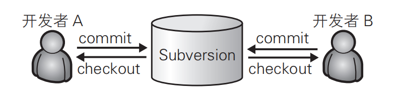
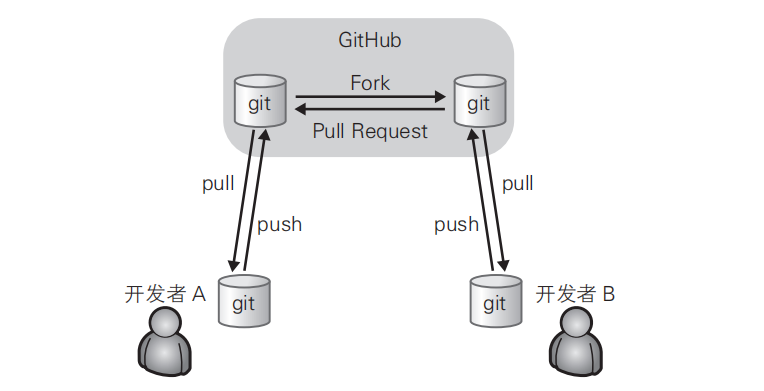
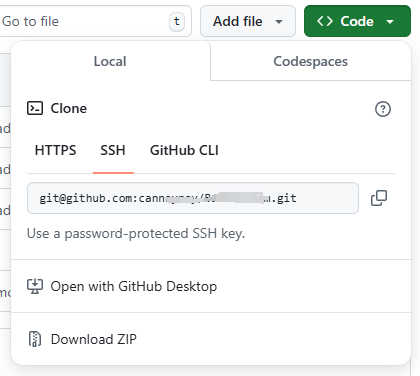

> 《GitHub入门与实践》 (大塚弘记) 

# 第1章 Github介绍

## 1.1 什么是Github

GitHub 除提供 Git 仓库的托管服务外，还为开发者或团队提供了一系列功能，帮助其高效率、高品质地进行代码编写。

> GitHub 的创始人之一 Chris Wanstrath 曾有个愿望，那就是能有一个Git 仓库的托管服务让自己与朋友轻松分享代码，而这便成为了 GitHub诞生的契机。不过，他也曾经表示：Git 仓库的托管服务是 GitHub 项目的目标之一，这只是漫长路程上的一个点而已。

**GitHub 与 Git 是完全不同的两个东西。**

在 Git 中，开发者将源代码存入名叫“Git 仓库”的资料库中并加以使用。而 GitHub 则是在网络上提供 Git 仓库的一项服务。也就是说，GitHub 上公开的软件源代码全都由 Git 进行管理。理解 Git，是熟练运用 GitHub 的关键所在。

## 1.2 社会化编程

世界上任何人都可以比从前更加容易地获得源代码，将其自由更改并加以公开。如今，世界众多程序员都在通过 GitHub 公开源代码，同时利用 GitHub 支持着自己日常的软件开发。

GitHub 的出现为软件开发者的世界带来了真正意义上的“民主”，让所有人都平等地拥有了更改源代码的权利。这在软件开发领域是一场巨大的革命。而革命领导者 GitHub 的口号便是“社会化编程”。

## 1.3 Github提供的主要功能

- Git仓库

- Organization

  个人使用时只要使用个人账户就足够了，但如果是公司，建议使用 Organization 账户。它的优点在于可以统一管理账户和权限，还能统一支付一些费用。

  如果只使用公开仓库，是可以免费创建 Organization 账户的。因此，如果是以交流群或 IT 小团体的形式进行软件开发时不妨试一试。

- Issue

  Issue 功能，是将一个任务或问题分配给一个 Issue 进行追踪和管理的功能。可以像 BUG 管理系统或 TiDD（Ticket-driven Development）的Ticket 一样使用。在 GitHub 上，每当进行我们即将讲解的 Pull equest，都会同时创建一个 Issue。

  每一个功能更改或修正都对应一个 Issue，讨论或修正都以这个Issue 为中心进行。只要查看 Issue，就能知道和这个更改相关的一切信息，并以此进行管理。

  在 Git 的提交信息中写上 Issue 的 ID（例如“#7”），GitHub 就会自动生成从 Issue 到对应提交的链接。另外，只要按照特定的格式描述提交信息，还可以关闭 Issue。

- Wiki

  通过 Wiki 功能，任何人都能随时对一篇文章进行更改并保存，因此可以多人共同完成一篇文章。

  Wiki 页也是作为 Git 仓库进行管理的，改版的历史记录会被切实保存下来，使用者可以放心改写。由于其支持克隆至本地进行编辑，所以程序员使用时可以不必开启浏览器。

- Pull Request

  开发者向 GitHub 的仓库推送更改或功能添加后，可以通过 Pull Request 功能向别人的仓库提出申请，请求对方合并。

  Pull Request 送出后，目标仓库的管理者等人将能够查看 Pull Request 的内容及其中包含的代码更改。

  同时，GitHub 还提供了对 Pull Request 和源代码前后差别进行讨论的功能。通过此功能，可以以行为单位对源代码添加评论，让程序员之间高效地交流。

  

# 第2章 Git（导学）

## 2.1 诞生背景

Git 属于分散型版本管理系统，是为版本管理而设计的软件。

> Linux 的创始人 Linus Torvalds 在 2005 年开发了 Git 的原型程序。当时，由于在 Linux 内核开发中使用的既有版本管理系统的开发方许可证发生了变更，为了更换新的版本管理系统，Torvalds 开发了 Git。

## 2.2 什么是版本管理

版本管理就是管理更新的历史记录。它为我们提供了一些在软件开发过程中必不可少的功能，例如记录一款软件添加或更改源代码的过程，回滚到特定阶段，恢复误删除的文件等。

### 集中型与分散型

**集中型**将所有数据集中存放在服务器当中，有便于管理的优点。但是一旦开发者所处的环境不能连接服务器，就无法获取最新的源代码，开发也就几乎无法进行。服务器宕机时也是同样的道理，而且万一服务器故障导致数据消失，恐怕开发者就再也见不到最新的源代码了。



**分散型**拥有多个仓库，相对而言稍显复杂。不过，由于本地的开发环境中就有仓库，所以开发者不必连接远程仓库就可以进行开发。

图中只显示了一般的使用流程。实际上，所有仓库之间都可以进行push 和 pull。即便不通过 GitHub，开发者 A 也可以直接向开发者 B 的仓库进行 push 或 pull。因此在使用前如果不事先制定规范，初学者往往会搞不清最新的源代码保存在哪里，导致开发失去控制。



## 2.3 使用

> 需要安装git

打开Git Bash，从名字中带有 Bash 就不难猜到，Git Bash 中照搬了许多 Bash 命令，习惯 Linux 的人用起来会感觉比 Windows 命令提示符更得心应手。

首先来设置使用 Git 时的姓名和邮箱地址。名字请用英文输入。

```bash
$ git config --global user.name "Firstname Lastname"
$ git config --global user.email "your_email@example.com"
```

这个命令，会在“~/.gitconfig”中以如下形式输出设置文件。

```bash
[user]
 name = Firstname Lastname
 email = your_email@example.com
```

**配置文件的存储路径**

1. 仓库级的配置文件：在仓库的 .git/.gitconfig，该配置文件只对所在的仓库有效。 
2. 全局配置文件：Mac 系统在 ~/.gitconfig，Windows 系统在 C:Users<用户名>.gitconfig。 
3. 系统级的配置文件：在 Git 的安装目录下（Mac 系统下安装目录在 /usr/local/git）的 etc 文件夹中的.gitconfig。

**提高命令输出的可读性**

```bash
$ git config --global color.ui auto
```

```
[color]
 ui = auto
```

这样一来，各种命令的输出就会变得更容易分辨，提高可读性。


# 第3章 使用GitHub的前期准备

## 准备

- 创建账户

- 设置头像

- 设置 SSH Key

  GitHub 上连接已有仓库时的认证，是通过使用了 SSH 的公开密钥认证方式进行的。现在让我们来创建公开密钥认证所需的 SSH Key，并将其添加至 GitHub。

  ```bash
  $ ssh-keygen -t rsa -C "your_email@example.com"
  Generating public/private rsa key pair.
  Enter file in which to save the key
  (/Users/your_user_directory/.ssh/id_rsa): 按回车键
  Enter passphrase (empty for no passphrase): 输入密码
  Enter same passphrase again: 再次输入密码
  Your identification has been saved in /Users/your_user_directory/.ssh/id_rsa.
  Your public key has been saved in /Users/your_user_directory/.ssh/id_rsa.pub.
  The key fingerprint is:
   fingerprint值 your_email@example.com
  The key's randomart image is:
  +--[ RSA 2048]----+
  | .+ + |
  | = o O . |
  ……
  ```

  id_rsa 文件是私有密钥，id_rsa.pub 是公开密钥。

- 添加公开密钥

  在 GitHub 中添加公开密钥，今后就可以用私有密钥进行认证了。

  点击右上角的账户设定按钮（Account Settings），选择 SSH Keys 菜单。

  添加成功之后，创建账户时所用的邮箱会接到一封提示“公共密钥添加完成”的邮件。

- 使用社区功能

## 实践

- New repository——创建仓库

  - Repository name——仓库名称

  - Description——仓库说明

  - Public、Private——创建公开仓库，仓库内的所有内容都会被公开

  - Initialize this repository with a README——随后GitHub 会自动初始化仓库并设置 README 文件，让用户可以立刻clone 这个仓库。如果想向 GitHub 添加手中已有的 Git 仓库，建议不要勾选，直接手动 push。

  - Add .gitignore

    下方左侧的下拉菜单非常方便，通过它可以在初始化时自动生成 .gitignore 文件。这个设定会帮我们把不需要在 Git 仓库中进行版本管理的文件记录在 .gitignore 文件中，省去了每次根据框架进行设置的麻烦。下拉菜单中包含了主要的语言及框架，选择今后将要使用的即可。

  - Add a license——选择要添加的许可协议文件

    如果这个仓库中包含的代码已经确定了许可协议，那么请在这里进行选择。随后将自动生成包含许可协议内容的 LICENSE 文件，用来表明该仓库内容的许可协议。

- 连接仓库

  - README.md

    README.md 文件的内容会自动显示在仓库的首页当中。因此，人们一般会在这个文件中标明本仓库所包含的软件的概要、使用流程、许可协议等信息。使用Markdown 语法进行描述，添加标记，提高可读性。

  - GitHub Flavored Markdown（GFM）

    在 GitHub 上进行交流时用到的 Issue、评论、Wiki，都可以用Markdown 语法表述，从而进行标记。

- 公开代码

  - clone 已有仓库

    将尝试在已有仓库中添加代码并加以公开。首先将已有仓库 clone 到身边的开发环境中。

    

    ```bash
    $ git clone git@github.com:hirocastest/Hello-World.git
    Cloning into 'Hello-World'...
    remote: Counting objects: 3, done.
    remote: Total 3 (delta 0), reused 0 (delta 0)
    Receiving objects: 100% (3/3), done.
    
    $ cd Hello-World
    ```

    这里会要求输入 GitHub 上设置的公开密钥的密码。认证成功后，仓库便会被 clone 至仓库名后的目录中。将想要公开的代码提交至这个仓库再 push 到 GitHub 的仓库中，代码便会被公开。

  - 提交

    ```bash
    $ git add hello_world.php
    $ git commit -m "Add hello world script by php"
    [master d23b909] Add hello world script by php
     1 file changed, 3 insertions(+)
     create mode 100644 hello_world.php
    ```

    通过 git add命令将文件加入暂存区，再通过 git commit命令提交。

    添加成功后，可以通过 git log命令查看提交日志。

    ```bash
    $ git log
    commit d23b909caad5d49a281480e6683ce3855087a5da
    Author: hirocastest <hohtsuka@gmail.com>
    Date: Tue May 1 14:36:58 2012 +0900
     Add hello world script by php
    ```

  - 进行 push

    ```bash
    $ git push
    Counting objects: 4, done.
    Delta compression using up to 4 threads.
    Compressing objects: 100% (2/2), done.
    Writing objects: 100% (3/3), 328 bytes, done.
    Total 3 (delta 0), reused 0 (delta 0)
    To git@github.com:hirocastest/Hello-World.git
     46ff713..d23b909 master -> master
    ```

    这样一来代码就在 GitHub 上公开了。

# 第四章 通过实际操作学习Git

## 4.1 基本操作

### git init——初始化仓库

```bash
$ git init
Initialized empty Git repository in /Users/hirocaster/github/github-book
```

如果初始化成功，执行了 git init命令的目录下就会生成 .git 目录。这个 .git 目录里存储着管理当前目录内容所需的仓库数据。

> 这个目录是隐藏起来的。Mac可以通过**CMD+SHIFT+.**来显示隐藏文件

在 Git 中，我们将这个目录的内容称为“附属于该仓库的工作树”。文件的编辑等操作在工作树中进行，然后记录到仓库中，以此管理文件的历史快照。如果想将文件恢复到原先的状态，可以从仓库中调取之前的快照，在工作树中打开。开发者可以通过这种方式获取以往的文件。

### git status——查看仓库的状态

```bash
$ git status
# On branch master
# Initial commit
nothing to commit (create/copy files and use "git add" to track)
```

结果显示了我们当前正处于 master 分支下。接着还显示了没有可提交的内容。所谓提交（Commit），是指“记录工作树中所有文件的当前状态”。

尚没有可提交的内容，就是说当前我们建立的这个仓库中还没有记录任何文件的任何状态。这里，我们建立 README.md 文件作为管理对象，为第一次提交做前期准备。

```bash
$ touch README.md
$ git status
# On branch master
#
(use "git add <file>..." to include in what will
# Initial commit
## Untracked files:# be committed)#
# README.md
nothing added to commit but untracked files present (use "git add" to
track)
```

> `touch` 是一个常见的 Unix/Linux 命令，用于 **创建空文件** 或 **更新文件的时间戳**。它的基本功能是与文件的访问和修改时间相关，常用于文件的管理和操作。
>
> ### 1. **创建文件**
> 如果指定的文件不存在，`touch` 会创建一个空的文件。该文件会有一个默认的大小（通常是 0 字节），并且文件的内容是空的。
>
> **示例：**
>
> ```bash
> touch example.txt
> ```
>
> - 如果 `example.txt` 文件不存在，`touch` 将创建一个新的空文件。
> - 如果文件已存在，`touch` 不会改变文件内容，只会更新文件的时间戳。
>
> ### 2. **更新文件的时间戳**
> `touch` 还可以用于更新文件的访问时间（`atime`）和修改时间（`mtime`）到当前时间。该命令不会改变文件内容，仅修改文件的时间信息。
>
> **示例：**
>
> ```bash
> touch example.txt
> ```
>
> - 如果 `example.txt` 已存在，执行后会更新该文件的修改时间和访问时间为当前时间。
> - 如果文件不存在，则创建一个新的空文件。
>
> ### 3. **选项**
> `touch` 命令还支持多个选项来控制其行为。
>
> - **`-c`** 或 **`--no-create`**：如果文件不存在，不创建文件，仅更新已有文件的时间戳。
>   
>   ```bash
>   touch -c example.txt
>   ```
>
> - **`-t`**：允许你手动设置时间戳，而不是使用当前时间。你需要指定一个特定的时间格式。
>   
>   ```bash
>   touch -t 202312251230 example.txt
>   ```
>   这会将 `example.txt` 的时间戳设置为 2023 年 12 月 25 日 12:30。
>
> - **`-d`** 或 **`--date`**：使用指定的日期和时间设置文件的时间戳。
>   
>   ```bash
>   touch -d "2023-12-25 12:30" example.txt
>   ```
>   这将文件 `example.txt` 的时间戳设置为给定的日期和时间。
>
> - **`-r`**：根据另一个文件的时间戳来设置目标文件的时间戳。
>   
>   ```bash
>   touch -r reference.txt target.txt
>   ```
>   这会将 `target.txt` 的时间戳设置为 `reference.txt` 的时间戳。
>
> ### 4. **使用场景**
> - **创建空文件**：用于快速创建一个空的文件，特别是在编写脚本或初始化项目时。例如，创建一个 `README.md` 文件，初始化一个日志文件等。
>   
> - **更新文件时间戳**：在某些版本控制系统（如 Git）中，`touch` 可以用于更新文件的时间戳，使其被认为是最近修改的，从而触发后续的操作。
>
> - **批量操作**：可以在批量操作中通过 `touch` 更新多个文件的时间戳。例如，在多个文件上执行时间戳更新操作，而不更改文件内容。
>
> ### 5. **总结**
> `touch` 是一个简单却强大的命令，通常用于以下两种场景：
> - **创建空文件**，如果指定文件不存在。
> - **更新文件时间戳**，而不修改文件内容。
>
> 通过其各种选项，`touch` 可以灵活地应用于不同的文件管理任务。

### git add——向暂存区中添加文件

如果只是用 Git 仓库的工作树创建了文件，那么该文件并不会被记入 Git 仓库的版本管理对象当中。因此我们用 git status命令查看README.md 文件时，它会显示在 Untracked files 里。

要想让文件成为 Git 仓库的管理对象，就需要用 git add命令将其加入暂存区（Stage 或者 Index）中。暂存区是提交之前的一个临时区域。

```bash
$ git add README.md
$ git status
# On branch master
# Initial commit
# Changes to be committed:
# (use "git rm --cached <file>..." to unstage)
#
# new file: README.md
```

### git commit——保存仓库的历史记录

git commit命令可以将当前暂存区中的文件实际保存到仓库的历史记录中。通过这些记录，我们就可以在工作树中复原文件。

- ……记述一行提交信息

```bash
$ git commit -m "First commit"
[master (root-commit) 9f129ba] First commit
1 file changed, 0 insertions(+), 0 deletions(-)
create mode 100644 README.md
```

-m参数后的 "First commit"称作提交信息，是对这个提交的概述。

- ……记述详细提交信息

刚才我们只简洁地记述了一行提交信息，如果想要记述得更加详细，请不加 -m，直接执行 git commit命令。执行后编辑器就会启动，并显示如下结果。

```bash
# Please enter the commit message for your changes. Lines starting
# with '#' will be ignored, and an empty message aborts the commit.
# On branch master
#
# Initial commit
#
# Changes to be committed:
# (use "git rm --cached <file>..." to unstage)
#
# new file: README.md
#
```

在编辑器中记述提交信息的格式如下：

- 第一行：用一行文字简述提交的更改内
- 第二行：空行
- 第三行以后：记述更改的原因和详细内容

只要按照上面的格式输入，今后便可以通过确认日志的命令或工具看到这些记录。

在以 #（井号）标为注释的 Changes to be committed（要提交的更改）栏中，可以查看本次提交中包含的文件。将提交信息按格式记述完毕后，请保存并关闭编辑器，以 #（井号）标为注释的行不必删除。随后，刚才记述的提交信息就会被提交。

> Vim编辑器中，

- ……中止提交

  如果在编辑器启动后想中止提交，请将提交信息留空并直接关闭编辑器，随后提交就会被中止。

- ……

- 查看提交后的状态

  执行完 git commit命令后再来查看当前状态。

  ```bash
  $ git status
  # On branch master
  nothing to commit, working directory clean
  ```

  当前工作树处于刚刚完成提交的最新状态，所以结果显示没有更改。

### git log——查看提交日志

commit 栏旁边显示的“9f129b……”是指向这个提交的哈希值。Git 的其他命令中，在指向提交时会用到这个哈希值。

Author 栏中显示我们给 Git 设置的用户名和邮箱地址。Date 栏中显示提交执行的日期和时间。再往下就是该提交的提交信息。

- ……只显示提交信息的第一行

  ```bash
  --pretty=short
  ```

- ……只显示指定目录、文件的日志

  只要在 git log命令后加上目录名，便会只显示该目录下的日志。

  如果加的是文件名，就会只显示与该文件相关的日志。

- ……显示文件的改动

  如果想查看提交所带来的改动，可以加上 -p参数，文件的前后差别就会显示在提交信息之后。

### git diff——查看更改前后的差别

git diff命令可以查看工作树、暂存区、最新提交之间的差别。单从字面上可能很难理解，各位不妨跟着笔者的解说亲手试一试。

当我们在刚刚提交的 README.md 中写点东西……

- ……查看工作树和暂存区的差别

```bash
$ git diff
diff --git a/README.md b/README.md
index e69de29..cb5dc9f 100644
--- a/README.md
+++ b/README.md
@@ -0,0 +1 @@
+# README
```

由于我们尚未用 git add命令向暂存区添加任何东西，所以程序只会显示工作树与最新提交状态之间的差别。

这里解释一下显示的内容。“+”号标出的是新添加的行，被删除的行则用“-”号标出。我们可以看到，这次只添加了一行。

用 git add命令将 README.md 文件加入暂存区。

```bash
$ git add README.md
```

- ……查看工作树和最新提交的差别

如果现在执行 git diff命令，由于工作树和暂存区的状态并无差别，结果什么都不会显示。要查看与最新提交的差别，请执行以下命令。

```bash
$ git diff HEAD
diff --git a/README.md b/README.md
index e69de29..cb5dc9f 100644
--- a/README.md
+++ b/README.md
@@ -0,0 +1 @@
+# README
```

不妨养成这样一个好习惯：在执行 git commit命令之前先执行git diff HEAD命令，查看本次提交与上次提交之间有什么差别，等确认完毕后再进行提交。这里的 HEAD 是指向当前分支中最新一次提交的指针。
